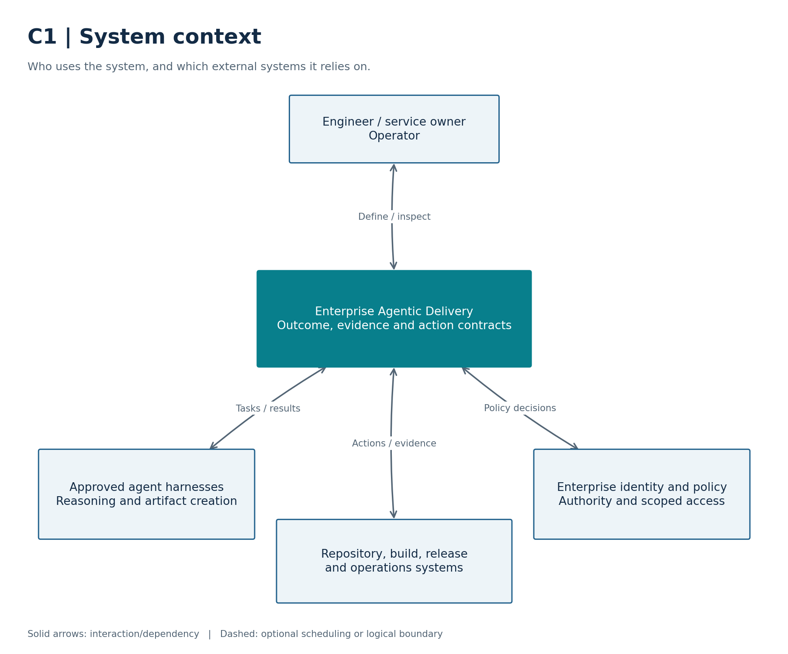
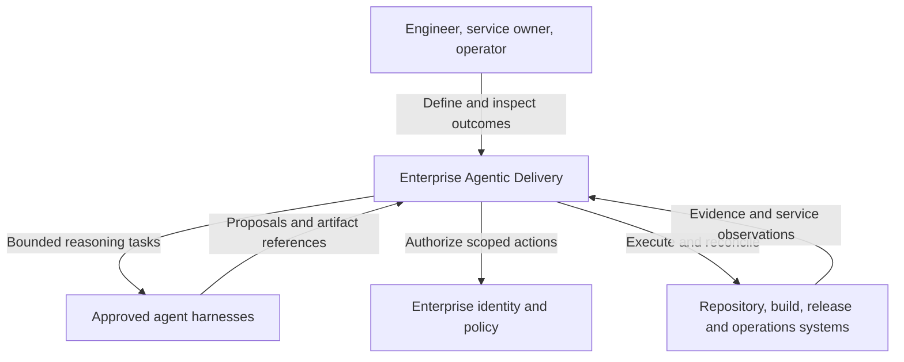
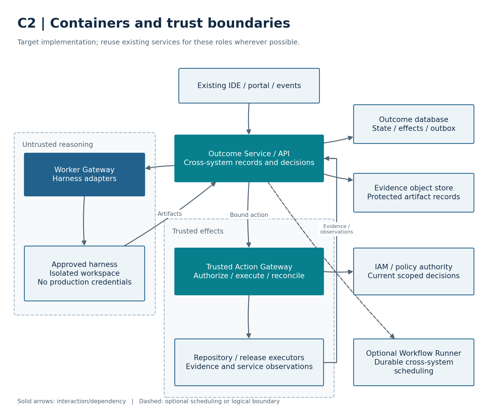
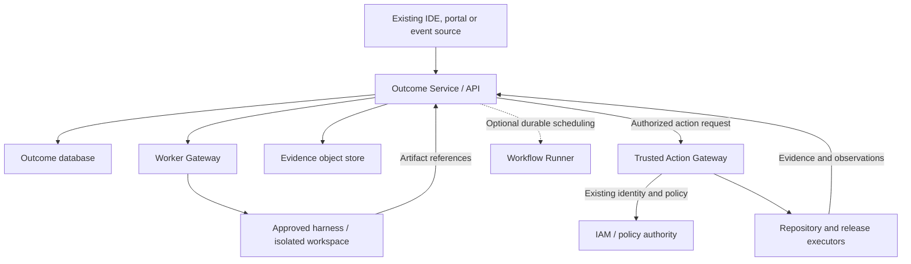
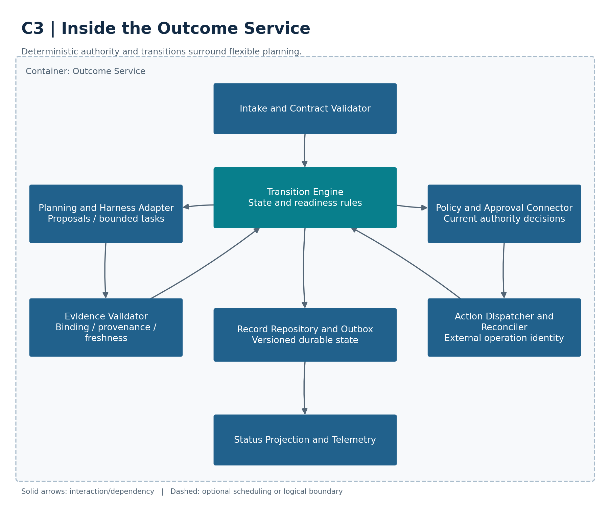
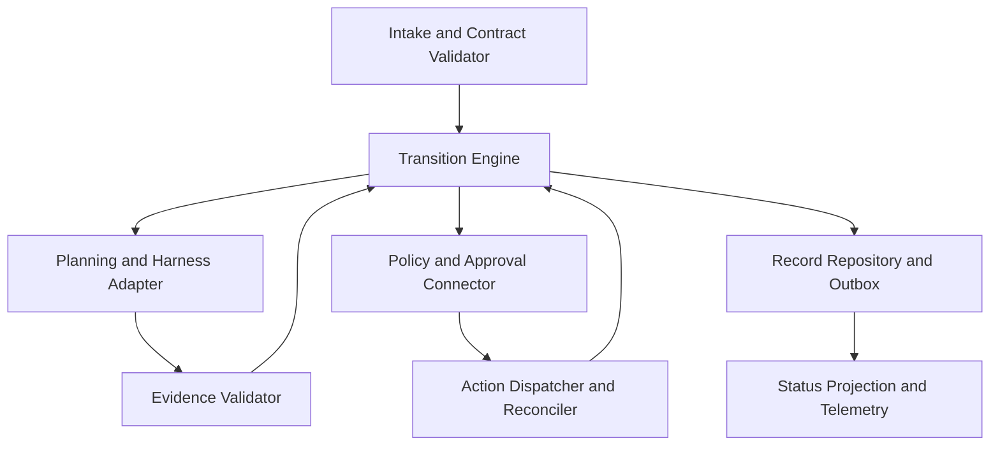
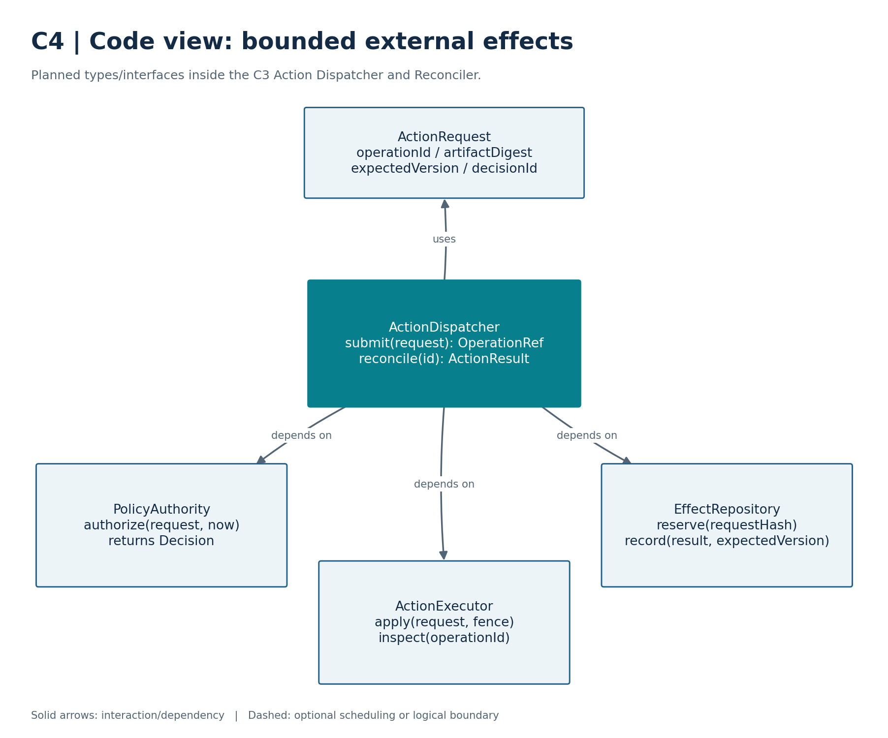
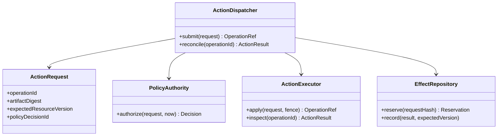

# Enterprise Agentic Delivery
## A small, enforceable architecture that grows through demonstrated outcomes

**Architecture proposal · 6 October 2026 · Version 1.0**

**Perspective:** I write this paper in the first person as its architectural author. The proposals, illustrative thresholds, and examples are my design judgments; they are not claims that a production implementation has been built or validated. This paper assumes no knowledge of earlier discussions and contains no employer-specific information.

## Executive argument

I began with a challenge: if modern agent harnesses already plan, delegate, remember, execute, and recover, does an enterprise still need a control plane? My answer is conditional. A new, centralized control-plane product is unnecessary for many useful workflows. An enterprise can begin with an approved harness, existing repository protections, established build and deployment services, and a small common contract for work and evidence. Adding another coordinator can increase delay, duplicate state, and introduce a new failure boundary.

However, removing a named control plane does not remove the need to decide who may act, preserve what happened, verify the exact change, and recover from incomplete operations. Those responsibilities can be distributed across existing systems. I therefore separate **enterprise control functions** from **control-plane topology**. I reject a mandatory central platform; I retain explicit ownership of essential functions wherever they are implemented.

I propose a federated enterprise delivery architecture with three stable contracts: an **outcome contract**, an **evidence contract**, and an **action contract**. Agent harnesses handle cognition and their internal agent loop. Existing trusted executors perform builds, tests, merges, deployments, and operational actions. A thin enterprise integration boundary connects them. Durable orchestration is added only when a workflow crosses systems, waits across sessions, or must survive failures that the selected harness cannot reconcile.

The strongest ideas in current products are complementary: fleet decomposition, bounded specialists, milestone validation, durable checkpoints, isolated workspaces, developer steering, and operational feedback. I combine these patterns, not every product. My starting implementation uses one harness and one delivery path. I widen the architecture only after a measurable result justifies the next capability.

My ultimate objective is a verified business outcome: a fix actually resolving a defect, a migration preserving behavior, a release sustaining service health, or a recovery restoring an agreed service objective. Agent activity, generated pull requests, and successful tool calls are intermediate observations. They are insufficient definitions of completion.

## 1. Context, vocabulary, and scope

### 1.1 The problem I am solving

Software delivery combines uncertain reasoning with consequential actions. A request such as “upgrade this service safely” may involve understanding dependencies, changing code, validating compatibility, building an artifact, releasing it, watching behavior, and responding to regressions. A coding agent helps with reasoning and artifact creation. An enterprise also needs stable boundaries around access, operational safety, and proof.

I use **agent** to mean a model-driven program that chooses steps and uses tools toward a goal. A **harness** surrounds that model with context management, tools, execution facilities, permissions, sessions, and possibly delegation. An **orchestrator** schedules and coordinates work. A **control plane** is the collection of mechanisms that manage policy, desired state, coordination, or lifecycle for an execution system. An **executor** performs a bounded action against a repository, build service, deployment target, or operational system. These roles may share a process; the definitions do not require separate services.

A **multi-agent workflow** uses more than one agent. This can mean a parent calling specialists, a team exchanging messages, a fleet working on independent changes, or remote agents collaborating across organizational boundaries. These patterns have different costs and failure modes. Conversation isolation does not imply filesystem, credential, process, or network isolation.

### 1.2 Outcomes and explicit design assumptions

I cover research and architecture, feature delivery, defect repair, dependency upgrades, repository migrations, policy remediation, progressive delivery, incident investigation, and bounded production recovery. The design can extend to infrastructure and data workflows, but they need their own domain-specific evidence and recovery strategies.

I make the following assumptions explicit rather than relying on unstated context. Removing one changes the deployment choice, not the basic reasoning.

| Assumption | Why I use it | Adaptation if false |
|---|---|---|
| The enterprise has a trusted identity system and accountable service owners. | Authority must originate outside an agent's prompt. | Establish identity and ownership before allowing shared write actions. |
| Repositories and delivery systems provide APIs or constrained command interfaces. | I need observable, bounded execution. | Start with read-only analysis or assisted execution; UI automation needs separate verification. |
| Some changes have meaningful production consequences. | Evidence and recovery must survive an agent session. | For low-impact local work, existing harness and repository controls may suffice. |
| The enterprise can store records and artifacts with access controls. | I need durable traceability. | Reuse repository checks and an existing artifact store; do not require a new database first. |
| Human owners remain accountable for outcome definitions and exceptions. | Agents cannot create their own enterprise mandate. | If ownership is unresolved, work remains advisory. |

I do not assume a particular cloud, IDE, model, vendor, repository host, delivery engine, regulatory regime, or enterprise scale. Specific numeric targets later in this paper are proposed pilot targets, not measured baselines or universal standards.

### 1.3 Evidence method and limits

I reviewed primary product documentation, maintained repositories, and protocol specifications on 6 October 2026. Numbered references identify the sources supporting factual product statements. I label my selections and architecture as proposals. I did not run paid-product comparisons, penetration tests, production pilots, or procurement assessments. Documentation demonstrates an advertised interface, not proven reliability in a particular enterprise.

One indexed Cursor result said Projects excluded Enterprise, while the subsequently retrieved live documentation said Enterprise was supported with version 3.21.9 or later. I use the live page and record this discrepancy because product access changes quickly. Claude's detailed team documentation could not be retrieved successfully; I verify the existence of teams from Anthropic's announcement and SDK capabilities from its official SDK documentation, and avoid treating unverified team lifecycle details as guarantees. [29, 3, 4]

## 2. First principles: what is actually necessary?

### 2.1 Start from consequences, not platform categories

I derive the architecture from five questions. What outcome is intended? Who has authority to change which resource? What evidence establishes that the change works? What happens when execution stops halfway through? Who determines that the real-world outcome was achieved?

A model can help answer the first and interpret the third and fifth. It should not be the sole enforcement authority for the second. Recovery in the fourth requires durable records and knowledge of the external system. Calling a coordinator a “control plane” answers none of these questions by itself.

| Required function for consequential work | Minimum sufficient realization | A new central service required? |
|---|---|---|
| Intent and acceptance | Versioned issue/specification with owner, scope, and measurable completion | No |
| Scoped authority | Existing IAM, repository protections, executor authorization | No |
| Evidence | Trusted checks and retained artifacts bound to revision or digest | No |
| Durable progress | Existing job state, release records, or a workflow ledger | Only when existing records leave a recovery gap |
| Safe effect execution | Bounded operation, preconditions, reconciliation, and recovery | No; often a deployment controller already does it |
| Observation and closure | Existing service telemetry plus explicit outcome evaluator | No |
| Portfolio coordination | Cross-domain prioritization and resource budgets | Only when demonstrated scale needs it |

For non-mutating research, the minimum can be much smaller: a clear question, source provenance, access control, and review. I avoid applying the full production contract to every conversation.

### 2.2 Disconfirming the mandatory-control-plane hypothesis

**Hypothesis H1:** every enterprise agent workflow needs a new central control plane. A counterexample is enough to reject that universal claim. Consider an agent producing a dependency-upgrade pull request in a protected repository. An existing build service tests it; branch rules enforce review; an existing release controller deploys it; service telemetry detects regressions. If these systems provide recoverable state and audit evidence, adding a central agent coordinator does not create an essential missing function. H1 fails.

**Hypothesis H2:** capable harnesses make enterprise control functions unnecessary. Consider a harness that deploys an artifact, loses connectivity after the deployment succeeds, and retries without knowing whether the first attempt committed. Or consider two agents changing the same production resource using stale approvals. Prompt quality does not establish single ownership, action identity, artifact binding, or current authorization. H2 fails for consequential work unless those functions are supplied by the harness or other infrastructure.

**Hypothesis H3:** distributed agents can replace all workflow coordination through messages. This is plausible for discovery or independent tasks. It becomes weaker when work waits for external approvals, holds scarce environment capacity, or performs a non-idempotent effect. Peers still need an authoritative record or domain owner to resolve disputes. I do not conclude that this record must be globally centralized.

**Hypothesis H4:** a purchased platform can eliminate the need for enterprise integration. It can eliminate custom implementation of many functions. It cannot eliminate the need to bind its permissions, records, and actions to enterprise resources and owners. If a purchased system already supplies the required contracts, I use it directly rather than build an overlapping layer.

### 2.3 The strongest objections to my own proposal

| Objection | When it is right | My response and abandonment criterion |
|---|---|---|
| A thin enterprise layer will grow into another slow platform. | It begins scheduling every tool call and storing every chat turn. | Limit it to outcome, evidence, action, and cross-system recovery. Remove it if existing systems cover these with equal quality and lower cost. |
| Evidence gates will recreate a bloated pipeline. | Every change repeats all checks regardless of relevance. | Use risk and dependency selection, reuse valid evidence, and retain only genuinely independent enforcement. Reject reuse when the environment or artifact has changed. |
| One harness is enough. | Work stays within its reliable state and policy boundary. | Keep one harness. Add portability only for an actual second-provider, residency, or continuity need. |
| Federation creates inconsistent policy. | Domains interpret mandatory rules differently. | Distribute versioned policy bundles and test their results; centralize policy definition where needed, execution where useful. |
| Agents can write their own tests and fool the evaluator. | The evaluator trusts agent assertions or tests alone. | Retain protected suites, independent execution, held-out scenarios, and service observations. A second model's agreement is not sufficient. |

### 2.4 My topology decision

I choose among three options, not between “control plane” and “no controls.”

| Topology | Appropriate setting | Tradeoff |
|---|---|---|
| Existing harness plus existing controls | One domain and an established delivery path | Least new code; cross-system recovery may remain manual |
| Federated thin integration boundary | Several tools or domains need common contracts | Domain autonomy with common evidence and authorization semantics |
| Central durable outcome service | Long-running cross-domain work lacks a reliable owner | Better shared recovery and portfolio visibility; greater operational dependency |

My default is the first topology for the pilot and the second for growth. I choose the third only from measured recovery and coordination gaps. A central model agent that coordinates every enterprise action is not my default.

## 3. Current architectures: what I can borrow and what I must verify

### 3.1 Comparison without a universal winner

The table is a pattern comparison. “Gap to check” identifies an enterprise requirement to validate, not an assertion that the product lacks it.

| Family | Documented architecture | Value I would borrow | Gap to check before adoption |
|---|---|---|---|
| Cursor Projects | Coordinator delegates to agents; persistent project context and recurring work [1, 29] | Separate responsive direction from execution; reusable project knowledge | Approved hosting, data handling, export, and availability in the enterprise's deployment |
| Copilot Fleet / SDK | Parent session, parallel subagents, explicit task dependencies; experimental Fleet binding [2] | Work ownership and dependency-aware dispatch | Version stability, workspace separation, restart and reconciliation behavior |
| Claude Code / Agent SDK | Programmable coding loop, tools, sessions, hooks, permissions, subagents; teams are announced [3, 4] | Strong local reasoning and specialized bounded delegation | Team versus SDK feature parity, effect recovery, and enterprise credential boundaries |
| Codex / Agents API / Agents SDK | Managed harness and durable sessions via API; SDK offers application-owned agent orchestration [5, 6] | Managed context and recovery, optional self-hosted execution | Session semantics versus external action semantics, retention and environment approval |
| Factory Missions / Droids | Planned missions, milestones, workers and validation; remote-computer execution [7–9] | Milestone acceptance and a usable long-running work interface | Enterprise policy for validation overrides and release authority |
| Kiro plus AWS DevOps Agent | Isolated subagent contexts and dependency graphs; operations integration through MCP/A2A [10, 11] | Connect development understanding to production investigation | Workspace isolation, cloud fit, and scoped operational actions |
| Google ADK | Graph, dynamic, collaborative, and template workflows [12] | Compose deterministic nodes with agent reasoning | Operational hosting, storage, authorization and effect handling |
| LangGraph plus Deep Agents | Checkpoint/store runtime plus harness with tools, memory and delegation [13, 14] | Inspectable state with a reusable agent loop | Replay boundaries, production topology, and infrastructure ownership |
| AutoGen / Microsoft Agent Framework | AutoGen in maintenance; successor offers checkpointed workflows [15, 16] | Explicit workflow composition and resumable execution | Successor migration, version fit, and session restore across providers |
| CrewAI | Crews within event-driven Flows with persisted state [17] | Straightforward business/engineering workflow composition | Meaning of persistence for in-flight external effects and multi-tenant operation |
| OpenHands | Modular software-agent SDK with tools, workspaces and delegation examples [18, 19] | Open implementation and replaceable execution facilities | Sandbox hardening, isolation and supported operating model |
| MetaGPT | Role-based software organization and structured operating procedures [20] | Explicit artifact handoffs and acceptance responsibilities | Production evidence beyond role simulation |
| ChatDev | Legacy virtual software company; 2.0 configurable multi-agent platform [21] | Experiment with workflow structure and collaboration | Production fitness beyond configurable agent conversations |

### 3.2 Fleet and team designs

Cursor's current documentation describes a coordinator that plans and delegates rather than writing code, project context maintained over months, and recurring work. The live page reports Enterprise access with a minimum application version, while legacy Privacy Mode remains incompatible. I borrow separation of direction from execution. I do not infer enterprise production readiness from a large advertised fleet size. [1, 29]

Copilot Fleet documents explicit shared task state and dependency-aware subagent dispatch. It recommends independent work units and warns against tightly coupled edits and small tasks. Its generated SDK Fleet binding is experimental. I borrow explicit ownership and readiness state, while placing experimental interfaces behind an adapter. [2]

Anthropic confirms Claude Code agent teams. The Agent SDK documentation separately describes a programmable Claude Code loop with built-in tools, context management, sessions, hooks, permissions, MCP, and subagents. I borrow its focused coding harness and scoped specialist pattern. I do not equate session/file checkpointing with a transaction that reverses production effects, nor assume all team features are exposed through the SDK. [3, 4]

### 3.3 Managed and mission-based designs

OpenAI's Agents API separates a managed Codex harness from its execution environment and the customer's application server. Documentation describes durable sessions, delegation, context compaction, and recovery. Environments may be hosted, self-hosted, or absent. OpenAI's Agents SDK is a different option for application-owned agent loops. I borrow the separation and managed operations where procurement and data boundaries permit it. Neither an agent turn completing nor a session becoming idle establishes business completion. [5, 6, 28]

Factory Missions use planned features and milestones with worker validation. The app exposes mission visibility and resumable work on remote Droid Computers; mission configuration inherits integrations, skills, hooks, and project instructions. Some validation settings are configurable. I borrow milestone acceptance and user visibility, and independently enforce enterprise release requirements at the action boundary. [7–9, 27]

Kiro documents subagents with independent conversation contexts and a shared workspace environment, plus dependency graphs and review loops. AWS DevOps Agent documents custom SRE agents, bring-your-own subagents, and MCP/A2A access for operational workflows. I borrow the continuity from development to investigation. I explicitly add workspace isolation when parallel writes require it; I do not mistake independent conversations for isolated files. [10, 11]

### 3.4 Framework and open implementations

Google ADK now documents graph-based, dynamic, collaborative, and template workflows, allowing agent reasoning and deterministic nodes to be composed. I borrow this separation of probabilistic choices from prescribed transitions. Choosing ADK does not by itself choose a database, credential model, or production release process. [12]

LangGraph documents checkpoints for per-thread state and stores for longer-term memory. Deep Agents layers context management, tools, filesystem facilities, delegation, and steering over the underlying runtime. I borrow inspectability and durable agent execution, while requiring external actions to use their own identifiers and reconciliation. Restoring reasoning state alone does not prove an external deployment happened exactly once. [13, 14]

AutoGen's maintained repository says it is in maintenance mode and directs new users to Microsoft Agent Framework. The successor's documentation describes checkpointed workflows with executor and message state. I retain AutoGen as an instructive pattern source, but evaluate the maintained successor for a new Microsoft-oriented implementation. [15, 16]

CrewAI Flows provide event-driven composition and persisted state, including a documented persistence decorator. I borrow the separation of a structured flow from a reasoning crew. I test crash handling of external writes rather than inferring it from the word “persistence.” [17]

OpenHands provides a modular software-agent SDK and a maintained delegation example. I borrow open execution infrastructure where inspectability and deployment choice matter. Enterprise fitness depends on the actual sandbox, credential access, network policy, and maintenance commitments selected. [18, 19]

MetaGPT's role-based software organization makes artifact handoffs and operating procedures explicit. ChatDev's legacy system modeled a virtual software company; its current 2.0 repository describes a broader configurable multi-agent platform. I borrow useful handoff and experimentation ideas. I do not equate simulated job titles, open-source availability, or configuration breadth with assured production delivery. [20, 21]

### 3.5 Combining strengths without creating a product collection

I keep the enterprise's stable semantics outside vendor-specific task schemas. Inside each harness I allow native planning and delegation. A native fleet task is not automatically an enterprise release authorization. A native memory file is not an authoritative service record. A native completion event is not automatically a validated outcome.

I select one primary harness by representative task quality, acceptable data handling, integration effort, recovery behavior, and cost per accepted outcome. I add one fallback only when continuity, residency, or measurable capability requires it. I do not deploy all thirteen families together. Frameworks are alternatives for building missing functionality, not mandatory layers to stack beneath every product.

## 4. My reference architecture

### 4.1 Three stable contracts

An **outcome contract** records what I want and what completion means. It contains owner, scope, context, constraints, acceptance criteria, risk class, deadline, and budget. It names exclusions and unresolved facts. A risk class follows enterprise rules; an agent can recommend a class but cannot lower it unilaterally.

An **evidence contract** records what was observed about a specific revision, artifact, environment, and test configuration. It includes producer identity, provenance, hashes, timestamps, freshness, and coverage limits. A statement such as “all tests pass” is a claim until trusted execution provides evidence.

An **action contract** identifies a bounded external effect, its authorized resource scope, exact input, preconditions, operation identity, expiry, and recovery or reconciliation method. It carries a policy decision and any required human authorization bound to that action. A plan is a proposal; an action authorization permits a particular effect under current conditions.

### 4.2 The smallest useful implementation

I begin with a versioned specification in an issue or repository, one approved harness, a structured result file, a repository check that validates evidence, and existing delivery controls. A small integration library translates those contracts into the harness's input and output. Existing identity, artifact storage, and telemetry remain authoritative.

For later cross-system workflows, I add a modular **Outcome Service** with an intake API, outcome record, policy integration, evidence validation, and adapters. It starts as one application with clearly separated modules, backed by the enterprise's established database and object store. It does not require microservices, a graph database, vector retrieval, A2A, or a new developer portal to deliver the first result.

I distinguish that logical target from the physical rollout. The following C4 diagrams show the mature reference implementation; Stage 1 may realize several boxes through existing services. C4's four levels are context, containers, components, and code. A container here means a separately runnable application or data store, not necessarily a Docker container. [22]

### 4.3 C1 — system context



**Figure 1.** People define and inspect outcomes. The delivery system delegates reasoning to approved harnesses, uses enterprise identity and policy, and acts through established engineering and operational platforms. Harnesses are shown as external systems because their lifecycle and trust boundaries are distinct. The system can be operated per domain rather than as one global instance.



### 4.4 C2 — containers and trust boundaries



**Figure 2.** The Outcome Service owns cross-system state; a worker gateway normalizes harness integrations; a trusted action gateway authorizes effects; evidence and state use separate retention semantics. Production credentials stay with trusted execution. An existing release controller can implement the action gateway. A durable workflow runner is an optional later container, not a second agent supervisor.



I require defense against bypass, not just a gateway diagram. Agent workspaces do not receive production write credentials, unrestricted network routes to management endpoints, or permission to modify protected policy and verification jobs. The action boundary is meaningful only if other paths cannot perform the same privileged action uncontrolled. Domain executors may enforce policy locally; a central network hop is optional.

### 4.5 C3 — Outcome Service components



**Figure 3.** I keep a deterministic transition engine separate from the planning interface. The evidence validator decides whether submitted evidence matches the current contract. The policy connector obtains an enforceable decision. The effect reconciler resolves uncertainty about external actions. These are modules in one service until independent scale or ownership justifies separation.



The planning interface proposes work and revisions. The transition engine validates readiness and records approved changes to the plan. It does not ask a language model whether authorization rules should be obeyed. Adapters preserve the native harness run/session identifier but do not leak its internal task graph into the public outcome contract.

### 4.6 C4 — code view for external effects



**Figure 4.** This code-level design zooms into the C3 Action Dispatcher and Reconciler. It specifies types and dependencies rather than inventing a fourth infrastructure layer. I include the planned interface below; it is implementation guidance, not a deployed service.



I implement the critical path as follows. Validate the request schema and authenticated identity. Reject an operation identifier reused with different input. Reserve a record with a uniqueness constraint and resource lease where necessary. Revalidate current policy, approval binding, artifact digest, target version, and revocation before the effect. Dispatch using an executor-supported idempotency key and fencing token when available. Record the external operation identifier. On a timeout, inspect the external operation before retrying. If inspection cannot determine whether a non-idempotent action happened, mark it indeterminate and require reconciliation rather than blindly resubmit.

There is no atomic transaction spanning an arbitrary enterprise database and every external tool. I use a transactional outbox for dispatch intent, at-least-once event delivery, deduplication, and explicit reconciliation. Exactly-once business effects are achievable only within the guarantees of a particular executor and operation, not by declaring the whole platform exactly-once.

## 5. Runtime behavior and contracts in detail

### 5.1 Outcome lifecycle

I use coarse enterprise states: **Defined, Active, Waiting, Ready for Action, Acting, Observing, Completed, Failed, Cancelled, Indeterminate**. Work tasks have their own smaller readiness/dependency states. I avoid making every harness thought or shell command an enterprise state transition.

Completion requires the acceptance evidence for that outcome. An architecture paper can complete when its research and review criteria pass. A production release completes only after deployment and a defined observation period satisfy service criteria. A failed acceptance test returns work to an explicitly bounded repair attempt; it does not trigger an unlimited loop.

| Transition | Required evidence or condition | Failure handling |
|---|---|---|
| Defined to Active | Valid contract, owner, scope, budget, approved harness | Ask for missing facts or keep advisory |
| Active to Ready for Action | Required independent evidence matches current artifact and environment | Repair within budget; preserve failure evidence |
| Ready for Action to Acting | Current authorization and preconditions | Wait, reject, or replan; do not reuse stale approval |
| Acting to Observing | External operation reconciled as applied | Indeterminate if effect cannot be established |
| Observing to Completed | Outcome-specific health and acceptance window satisfied | Recovery, escalation, or failed outcome |
| Any active state to Cancelled | Cancellation recorded; effects reconciled and execution stopped safely | In-flight effects may still complete; record residual state |

### 5.2 Canonical records

| Record | Essential fields | Authority |
|---|---|---|
| Outcome | ID, contract version, owner, scope, exclusions, acceptance, risk, budget, state version | Domain outcome owner |
| Task | ID, outcome ID, dependencies, write ownership, inputs, expected outputs, attempt limit | Workflow owner |
| Harness run | Provider, runtime version, session/run ID, model version where available, configuration digest, workspace revision | Adapter observations |
| Evidence | Artifact/revision digest, environment, suite/config version, trusted producer, result, timestamps, coverage, retention | Protected verifier |
| Action | Operation ID, request hash, target, desired effect, expected version, expiry, decision and approval bindings | Trusted executor boundary |
| Observation | Service, cohort, metric definition, time range, baseline, provenance, outcome correlation | Monitoring systems |
| Learning proposal | Source outcomes, proposed instruction change, evaluator version, scope, expiry, status | Knowledge owner after review |

I keep searchable memory separate from these authoritative records. Access control follows tenant/domain and data classification, not just a globally unique identifier. Content access is checked before retrieval, including vector search results if a vector store is added later.

### 5.3 Adapter interface and portability

My proposed harness adapter exposes `capabilities`, `start`, `status`, `collect_artifacts`, and, where supported, `steer`, `cancel`, and `resume`. Capabilities declare supported versions, execution locality, file/network isolation, output schemas, session retention, subagent support, export, and cancellation limits. A missing capability is explicit.

I do not promise that a Claude session can resume inside Codex or Copilot. Cross-harness recovery starts a new bounded task from canonical artifacts, known external state, and a structured handover. Hidden reasoning and vendor summaries are not a portable transaction log. The replacement task must revalidate current inputs and authorization.

I use native SDKs or supported APIs where available. A CLI adapter can support the first pilot, but it must capture exit status, structured results, artifact paths, and run identity; parsing free-form conversation text is unsuitable as a production authorization signal. Native fleet coordination remains inside the harness unless a task crosses an enterprise responsibility boundary.

### 5.4 MCP, A2A, and ordinary APIs

MCP connects an agent to tools and context; A2A provides agent discovery and task-oriented communication across agent boundaries. Their security and authentication semantics require implementation. Neither protocol replaces the enterprise's authorization for a deployment, nor makes a claimed capability trustworthy. [23, 24]

I start with normal authenticated APIs and native SDKs. I add MCP when multiple approved clients benefit from a common tool surface. I add A2A when independently operated agent services need task interoperability. I pin protocol versions and negotiate capabilities; I do not make every internal module communicate over A2A.

MCP security guidance addresses confused-deputy risks and token handling. I terminate and validate credentials at their proper resource boundary, use audience-bound tokens, and avoid treating a tool server as permission to forward arbitrary credentials. Tool descriptions and outputs remain untrusted content for reasoning; tool registration requires ownership and review. [23]

## 6. Verification, security, and safe learning

### 6.1 Shift validation toward creation without weakening trust

I run useful checks early so the agent repairs defects before consuming expensive shared delivery capacity. Examples include compilation, contract tests, policy linting, dependency scans, and representative service startup. An early local result reduces wasted work. It becomes reusable release evidence only when its producer, environment, artifact, and configuration meet the release's trust requirements.

I define an evidence fingerprint from source revision, built artifact digest, dependency lock digest, suite version, policy bundle version, and relevant environment characteristics. A change in any material field invalidates affected evidence. A trusted remote build may still be required even when a local agent reports a successful build.

SLSA provenance supplies a standard structure for identifying build inputs and the producing build system. I use provenance where applicable, but do not claim that provenance alone proves correctness, policy compliance, or service health. [25]

### 6.2 Independent verification and disconfirmation

I separate three evidence classes: agent assertions, reproducible execution records, and independent acceptance evidence. A builder can propose tests. A protected verifier executes them and additional checks outside the builder's write authority. For high-impact changes, human review or domain-specific independent validation remains part of the acceptance contract.

| Design claim | What could disconfirm it | Evidence I require |
|---|---|---|
| Multiple agents improve delivery. | Same tasks take longer, cost more, or fail more after integration. | Matched single-agent and multi-agent task cohorts with accepted outcomes |
| The agent's tests establish correctness. | A held-out scenario or unchanged consumer fails. | Protected suites, contract consumers, mutation or adversarial cases where useful |
| Shared memory improves work. | Stale or wrong instructions cause recurrent failures. | Versioned memory evaluation against a no-memory baseline |
| A new central service adds value. | Existing services handle recovery and evidence more cheaply. | Removal experiment with equivalent controls and observed workload |
| An automated release is safe. | Health degrades despite passing pre-release checks. | Service observations, bounded rollout, tested recovery |

I use an independent reviewer role to search for missing assumptions, counterexamples, and harmful simplifications. I do not treat “two agents agree” as statistical independence. Similar models can share blind spots, and different models can still rely on the same incorrect source. I prioritize external evidence over consensus.

### 6.3 Enterprise threat and failure boundaries

| Risk | Preventive design | Detection and response |
|---|---|---|
| Prompt injection in a repo, ticket, document or log | Treat retrieved content as data; constrain tools and privileges outside prompts | Detect forbidden tool attempts; stop affected run and inspect exposure |
| Agent obtains production authority indirectly | No ambient production credentials; restricted network and executor allowlists | Audit denied/bypassed paths; revoke scoped credentials |
| Tenant or domain data leaks through memory | Per-domain retrieval authorization and redaction | Access audit, deletion propagation, incident handling |
| Evidence is fabricated or modified | Trusted producer identity; artifact hashes; protected suites and records | Reject mismatch; rerun independent verification |
| Approval is replayed for another artifact | Bind to operation, digest, target, policy version and expiry | Reject binding mismatch; obtain current decision |
| Stale worker overwrites a newer change | Write ownership, resource versions, leases and fencing | Reject stale effect; reconcile current external state |
| Tool or package supply-chain compromise | Approved tool registry, pinned dependencies, controlled build images | Quarantine tool version and affected evidence |
| Self-modifying memory or policy bypasses governance | Agent submits proposals; protected promotion pipeline | Revert versioned bundle and affected automations |

These mechanisms are design requirements. Enterprise readiness also requires operational validation and applicable internal obligations; this paper does not claim certification or regulatory compliance.

### 6.4 Learning that can be reversed

I distinguish four kinds of information: source facts with provenance, verified procedural knowledge, run-local hypotheses, and authoritative workflow state. Only reviewed procedural knowledge becomes reusable instructions. I keep provenance, applicable resource versions, scope, owner, and expiry with each knowledge item.

After an outcome, an agent can propose an instruction, skill, routing, or test improvement. A promotion workflow evaluates it on held-out cases, compares regressions, and obtains the appropriate owner decision. I release the change to a small cohort, measure it, and retain the old version for recovery. Agents do not automatically rewrite enterprise policy from one apparently successful incident.

A vector or specialist memory system can later improve retrieval. It is optional: retrieval accuracy, access control, freshness, deletion, and incremental task performance must justify it. I never store the only copy of release state in semantic memory.

## 7. Failure handling and production outcomes

### 7.1 Design for interrupted work

| Failure | Safe behavior | Persisted proof |
|---|---|---|
| Harness crashes while editing | Preserve branch/workspace snapshot; start or resume bounded task | Base revision, changed files, artifact references, run identity |
| Event delivered twice | Deduplicate by event ID and record version | Inbox entry and accepted transition |
| Effect succeeds but response is lost | Inspect by operation ID before another write | External operation reference and reconciled result |
| Executor lacks idempotency or inspect support | Do not automatically retry uncertain effects | Indeterminate state and operator reconciliation |
| Policy is unavailable | Stop new privileged effects; allow safe reads | Denial/wait reason and last applicable bundle |
| Human approval expires during delay | Reauthorize exact pending effect | New decision and digest/target binding |
| Budget or deadline is reached | Stop spawning tasks; reconcile running effects | Cost/time ledger and residual actions |
| Memory conflicts with current repository | Prefer authoritative current inputs; invalidate knowledge | Conflict evidence and knowledge version |
| Observation telemetry disappears | Pause progression; do not infer success from silence | Missing-signal window and recovery decision |

Where a deployment is already in progress, a trusted controller may continue a previously authorized, bounded safety sequence using valid local policy. New unbounded changes remain blocked. I document the maximum offline interval, revocation strategy, and recovery authority; “fail closed” cannot mean abandoning a service halfway through its safety procedure.

### 7.2 From delivery to operation

For a service release, I require the exact artifact, target, rollout stages, health metrics, observation windows, abort thresholds, and recovery action to be known before production begins. The trusted release controller executes these mechanics. An agent may interpret anomalous behavior and propose alternatives; it cannot silently widen its authorization or extend its blast radius.

Golden signals such as errors and latency are useful, but insufficient for every outcome. A payment or data workflow may need business correctness, freshness, reconciliation totals, or consumer contracts. I bind acceptance to the service's actual objective and require enough volume or representative probes to make the observation meaningful.

I avoid promising automatic rollback for irreversible changes. A database migration may require expand-and-contract compatibility, a roll-forward repair, restoration, or manual reconciliation. The outcome contract states what can and cannot be recovered. If recovery is not acceptable, the action remains constrained or assisted.

### 7.3 Broad outcome catalog

| Outcome | Agent contribution | Trusted evidence and executor | Completion |
|---|---|---|---|
| Research and architecture | Sources, alternatives, counterexamples, paper and diagrams | Source ledger and independent review | Questions answered with traceable claims and unresolved facts |
| Feature or defect repair | Reproduce, implement, explain | Protected tests, review and release service | Accepted behavior demonstrated in intended environment |
| Dependency or runtime upgrade | Assess compatibility and edit | Lock/build provenance, consumer tests | Upgrade accepted without defined regressions |
| Repository fleet migration | Partition work and resolve exceptions | Per-repo checks and wave rollout | Eligible cohort migrated with exception accounting |
| Pipeline improvement | Propose task/config changes | Policy checks and representative build replay | Measurable reliability or time improvement |
| Compliance remediation | Locate violations and prepare changes | Authoritative rule version and protected evaluation | Required evidence passes for scoped assets |
| Release execution | Diagnose readiness and propose plan | Release controller, health probes and recovery | Validated completion within agreed service conditions |
| Incident investigation | Correlate signals and changes | Logs, metrics, traces and operator review | Supported cause/mitigation with documented uncertainty |
| Bounded operational recovery | Propose an approved runbook action | Scoped executor and outcome observation | Service restored without exceeding authority |
| Infrastructure/data change | Prepare configuration or migration | Domain-specific validation and reconciliation | Target state and correctness demonstrated |

The common contracts let these outcomes share infrastructure. Their acceptance rules differ. I never translate “the agent finished” into one universal success condition.

## 8. Iterative construction with value at every stage

### 8.1 Stage 0 — establish facts and select one outcome

I inventory current controls before building a replacement. I select a bounded, frequent workflow with measurable waiting or rework: for example, dependency upgrades on a small cohort of noncritical services. I baseline accepted completion time, human effort, failure causes, review rejection, and recovery behavior. I include failed and abandoned attempts in denominators.

The deliverable is an outcome specification, test/evidence map, threat boundary, and ownership decision. The immediate value is identifying whether the bottleneck is agent capability, repository readiness, missing tests, approval queues, or environment availability. If a conventional script solves the task reliably, I use the script.

### 8.2 Stage 1 — improve creation and produce useful pull requests

I deploy one harness with repository guidance, an explicit outcome contract, early checks, and a structured evidence bundle. Existing repository protections and build services own merge/release. I limit agent scope to approved branches and tools. I add no new production-write authority.

I propose a pilot of roughly 20–30 comparable tasks where task diversity permits, compared with the current process. My illustrative progression gate is at least a 20% reduction in median human effort with no material decline in accepted quality and no scope violations. A small sample cannot prove rare-event safety. I also review tail behavior and every serious failure. This stage can remain the final architecture if it meets the need.

### 8.3 Stage 2 — make work restartable and evidence portable

I add the thin Outcome Service only where existing records fail to connect artifacts, approvals, and external effects. I normalize run identifiers, evidence validation, event deduplication, and bounded reconciliation. I add a second harness adapter only for a real use case, testing task transfer through artifacts rather than assuming session migration.

Value is less manual coordination and fewer abandoned tasks after interruption. My illustrative gate is successful reconciliation of all injected duplicate-event and lost-response cases in the pilot suite, plus reduced operator recovery effort. Where existing workflow services already pass, I integrate them rather than implement a second scheduler.

### 8.4 Stage 3 — bounded multi-agent and fleet delivery

I introduce multiple workers only for work that can be separated cleanly: independent repositories, modules with stable contracts, or distinct review questions. Each worker receives write ownership, input revision, output schema, acceptance criteria, and cost/time limits. Shared changes require integration by a designated owner.

I compare a single-agent baseline against bounded parallelism on matched task classes. Total cost includes integration, rework, human review, and failed attempts. I grow a fleet in waves: canary repositories, a first cohort, expansion, then long-tail exceptions. My illustrative gate is improved elapsed accepted completion time without higher rework or worse quality at an agreed cost. If parallelism loses, I retain one agent.

### 8.5 Stage 4 — safely extend into deployment

I connect one trusted release executor and one well-observed deployment strategy. I use existing build and release systems while binding artifact evidence and authorization. I run in shadow or advisory mode first, compare readiness decisions with service owners, then authorize a limited service cohort.

Value is reduced release coordination and more predictable validated completion. Progression requires tested pause/recovery behavior, reliable health signals, artifact-bound approvals, and reconciliation after an ambiguous response. The enterprise sets acceptable risk and service thresholds; I do not infer them from a model's confidence score.

### 8.6 Stage 5 — operations, governed learning and broader outcomes

I introduce read-only incident investigation before scoped operational actions. I add reviewed procedural memory, domain-specific outcome packs, portfolio capacity budgets, and improved feedback from production. Each new outcome family goes through its own readiness review and pilot; success in dependency upgrades does not authorize database repair.

Value is faster diagnosis, lower repetitive engineering effort, and accumulated verified procedures. Progression requires improved restoration or diagnosis outcomes, no unacceptable access expansion, and evaluated learning changes that can be reversed. I consider centralized portfolio orchestration only when domain coordination demonstrably needs it.

### 8.7 Build gates and reversible decisions

| Stage | Useful deliverable | Add only what is missing | Stop, simplify, or revert when |
|---|---|---|---|
| 0 | Baseline and outcome/evidence map | Instrumentation | A script or existing service solves the problem |
| 1 | Better accepted PRs | One harness integration | Review effort, quality or total cost deteriorates |
| 2 | Restartable work | Shared records and reconciler | New platform costs exceed recovery benefit |
| 3 | Faster accepted migration waves | Bounded task ownership and integration | Coupling and rework erase parallel speedup |
| 4 | Validated releases | Trusted action binding and health evaluation | Observability or recovery is inadequate |
| 5 | Broader verified outcomes | Domain packs and governed learning | Benefits do not transfer or memory creates regressions |

I do not attach fixed dates to stages without knowing team capacity and service readiness. A stage is earned by evidence, not calendar time. Each stage has standalone utility and may be the appropriate stopping point.

## 9. Economics, operating model, and platform choices

### 9.1 Measure value rather than output volume

I define accepted-outcome rate as accepted outcomes divided by all attempted outcomes, including failed and abandoned work. I measure elapsed lead time from a defined start to validated completion; I report production workflow duration separately from commit-to-production lead time. These clocks answer different questions.

I calculate **cost per accepted outcome** as total model, compute, integration/rework, human review, and allocated operating cost divided by accepted outcomes. A sixfold increase in generated PRs does not establish a corresponding increase in useful output. I report review rejection, escaped defects, service regressions, and human effort alongside speed.

For a planning estimate, suppose 200 monthly tasks save 0.75 human hours each, but add 30 hours of review/rework and 40 hours of platform operation. Net saved time is 80 hours before valuing model and compute costs. This is an illustrative arithmetic example, not an ROI forecast. It makes the cost of a custom platform visible.

### 9.2 Multi-agent capacity and coupling

I estimate elapsed time as serial work plus the longest parallel branch plus coordination, integration, and verification. More workers shorten only separable work. Shared bottlenecks, rate limits, build queues, and contested files remain serial costs. I cap workers per tenant/domain and enforce model-token, compute, environment, and human-review budgets.

The fleet scheduler, where used, admits work based on ready dependencies and available capacity. It handles priority, fairness, cancellation, and bounded retries. It does not spawn agents simply because capacity exists. A model can propose decomposition; the admission controller enforces limits.

### 9.3 Buy, integrate, or build

| Capability | My default | When I would build |
|---|---|---|
| Model/tool agent loop | Adopt one approved harness | A measured unmet requirement cannot be supplied or extended |
| Durable cross-system workflow | Reuse enterprise workflow platform or selected vendor capability | Ownership and recovery gaps remain after integration |
| Identity, secrets and policy authority | Reuse established services | Not as a new agent project |
| Build and release execution | Reuse existing executors | Specific primitives need a simpler bounded implementation |
| Evidence semantics and outcome mapping | Define enterprise contracts | Usually the genuinely enterprise-specific work |
| Memory | Versioned reviewed knowledge first | Retrieval/scale benefits are measured |
| UI | Existing IDE, portal, checks and workflow views | Users cannot understand ownership, decisions or recovery through current surfaces |

Temporal is one candidate for durable cross-system workflows; its documentation explains history-based replay and recovery. LangGraph, ADK, Microsoft Agent Framework, CrewAI, or a managed harness may suffice within their intended boundaries. I choose one owner for each workflow's state. I do not stack multiple durable engines without a clear ownership boundary. [12–17, 26]

### 9.4 Domain federation and operations

I assign outcome definitions and acceptance to domain owners; runtime integration and shared contracts to the delivery platform team; credential and mandatory-policy authority to existing security/platform owners; service health and recovery to service/SRE owners. A human exception identifies who accepted which risk for which action and how long it remains valid.

The mature deployment can use regional or domain instances with shared schemas and policy bundles. I avoid a global lock or central queue for every release. State is partitioned by accountable domain and resource; cross-domain dependencies have explicit handoff contracts. Disaster recovery requires tested backups, restore procedures, and reconciliation with live external systems after restoration.

Proposed pilot service objectives are: status visible within ten seconds for ordinary events, detection of a stale execution lease within one minute, and no new privileged action without a current authorization decision. These are design targets subject to workload testing. Production RTO, RPO, retention and regional availability remain enterprise decisions; I will not invent them.

## 10. Do Jenkins, Spinnaker and GitLab become redundant?

I separate a product from its necessary function. Enterprises still need reproducible builds, isolated tests, artifact publication, target changes, progressive release, observation, and recovery. An agent can decide which actions to request. That does not make execution infrastructure unnecessary.

In the first stages, Jenkins, Spinnaker, GitLab, GitHub Actions, Harness, or other existing systems remain authoritative for the work they already do well. I add adapters and evidence exports. I reduce manual coordination and duplicated workflow logic where useful. Replacing an incumbent is a later economic and reliability decision.

I consider retirement only when the replacement provides equivalent or better isolation, reproducibility, authorization, artifact lineage, cancellation, concurrency control, operational recovery, and observability, and passes representative failure tests. I first migrate one bounded workflow, retain a reversible route, and compare costs and outcomes. A model-driven sequence of shell commands does not automatically satisfy those obligations.

The important migration is from tool-shaped outcomes to contract-shaped outcomes. A request becomes “deploy this verified artifact to this service under this health contract,” rather than “run job number 417.” The executor can change behind that contract. This reduces dependency on a specific orchestration product without forcing a premature infrastructure rewrite.

## 11. Validation plan and architecture decisions

### 11.1 Tests that can overturn this design

| Experiment | Comparison | Evidence that changes my decision |
|---|---|---|
| Remove the custom Outcome Service | Existing systems with identical contract/evidence requirements | Equal recovery and policy coverage at lower total cost: remove it |
| Single agent versus bounded fleet | Matched task classes, same acceptance checks | Fleet has no net lead-time benefit or worse rework: use one agent |
| Native vendor state versus external workflow | Crash and resume across real enterprise integrations | Native state handles every needed failure: avoid outer orchestration |
| Early evidence reuse versus rerun | Trusted identical artifact/environment versus changed conditions | Reuse misses a real failure: tighten fingerprint and invalidate more evidence |
| Memory-enabled versus no-memory | Held-out tasks and stale-knowledge cases | Regression or negligible gain: remove or narrow memory |
| Advisory versus automatic release | Shadow outcomes then bounded cohort | Unsafe false positives or unreliable recovery: remain advisory |
| Incumbent executor versus replacement | Same workload, failure cases and protection requirements | Replacement fails controls or costs more: keep incumbent |

I specify success and failure thresholds before the experiment. Owners record results, rejected tasks, and unexplained cases. I use held-out evaluation where feasible and avoid reporting only the easy tasks that completed.

### 11.2 Enterprise acceptance suite

Before production write authority, I require demonstrated denial of unauthorized actions and bypass paths; no cross-domain data access; artifact and approval binding; stale-worker fencing; duplicate-event handling; loss-of-response reconciliation; cancellation with in-flight effects; unavailable policy/telemetry handling; evidence invalidation; and recovery under the target service's actual failure conditions.

I also test operational ownership: someone can determine current state, explain why an action was authorized, stop new effects, reconcile an indeterminate operation, restore records, and revert an instruction or adapter version. These tests assess the system around the model, not just whether the model solves benchmark coding tasks.

### 11.3 Initial architectural decision records

| ID | Decision | Rationale | Revisit trigger |
|---|---|---|---|
| ADR-01 | No mandatory central control-plane product | Existing infrastructure can realize control functions | Unowned cross-domain recovery gaps |
| ADR-02 | One primary harness initially | Reduces integration and operational burden | Proven capability, residency or continuity need |
| ADR-03 | Outcome/evidence/action contracts remain stable | Decouples enterprise semantics from vendor internals | Repeated adapter semantics that cannot be expressed |
| ADR-04 | Privileged effects through trusted executors | Enforcement survives prompt failure | Equivalent enforcement at another owned boundary |
| ADR-05 | Existing CI/CD remains initially | Avoids replacing proven execution while learning | Replacement passes controls and economics |
| ADR-06 | Multi-agent use is conditional | Coordination can negate parallelism | Matched workload demonstrates net advantage |
| ADR-07 | Learning changes require evaluated promotion | Prevents unreviewed procedural drift | A domain proves bounded automatic promotion is safe |
| ADR-08 | Start with a modular application | Logical boundaries need not be network boundaries | Independent scale, failure or ownership requires a split |

## 12. Worked example: a safe dependency upgrade

I define the outcome as upgrading an approved library in one service, preserving its public API and documented behavior, and deploying the exact accepted artifact to a small production cohort. The owner supplies exclusions, acceptance checks, release strategy, health conditions, and the time/cost budget.

The selected harness inspects source and dependency constraints, reproduces relevant behavior, and edits in a branch/workspace based on a recorded revision. A specialist is added only if compatibility analysis is separable and useful. The harness runs early checks and returns a patch, structured findings, test proposals, and artifact references.

A trusted build/verifier runs protected checks, including consumer compatibility cases. If a consumer contract fails, the failed evidence remains in the outcome record and a bounded repair task starts. An agent cannot remove the failing consumer check and declare success. If the change exceeds scope or budget, the owner sees the blocker and a recommendation.

Repository protections govern merge. The release action binds a signed/attested artifact digest, target service, expected current version, observation window, recovery choice, and current authorization. The trusted executor submits the change using an operation identifier. If its response is lost, the reconciler inspects that operation and discovers the deployed digest rather than redeploying blindly.

The controller observes the defined service metrics. A health failure triggers the previously authorized recovery sequence; a missing signal pauses progression. If the service meets acceptance, the outcome completes with the observed deployment and health evidence. A learning proposal may record a verified compatibility procedure. That proposal is evaluated before becoming a shared instruction.

This example can begin at Stage 1 as an accepted PR and later grow through restartability, bounded parallel repository waves, release automation, and operational learning. The same contract structure supports an architecture research task, but its acceptance evidence is sources, alternatives, review, and diagram consistency rather than deployment health.

## 13. My resulting recommendation

I would authorize a narrow pilot, not a large platform build. I would choose one frequent outcome, one approved harness, and one trusted delivery path. I would define evidence and authority before adding more workers. I would retain established execution and service controls while measuring accepted outcomes and total cost.

I would then add only the missing coordination, recovery, and portability capabilities that the pilot demonstrates. The long-term architecture is a small set of stable contracts, replaceable harnesses, domain-owned outcomes, and trusted executors with feedback. It can grow to handle many enterprise delivery outcomes without requiring every task to pass through a central AI supervisor.

My position can be disproved. If a selected platform already supplies all necessary contracts and reliable cross-system behavior, I would omit the custom Outcome Service. If multi-agent work underperforms, I would use one agent. If replacing CI/CD does not improve verified outcomes and economics, I would keep it. Those are intended design choices, not failures of ambition.

## Appendix A. Illustrative portable contracts

The following YAML illustrates enterprise semantics, not a vendor's API. Placeholders identify facts that the owner must provide. This example is deliberately scoped to a dependency-upgrade outcome; other domains define different acceptance and recovery rules.

```yaml
schema_version: "1.0"
outcome:
  id: "outcome-example-001"
  contract_version: 1
  owner: "required-service-owner"
  intent: "Upgrade the approved library while preserving service behavior"
  scope:
    repositories: ["approved/service-a"]
    allowed_paths: ["src/**", "dependency-lock"]
    exclusions: ["protected policy", "production secrets", "unrelated API changes"]
  acceptance:
    required_checks: ["trusted-build", "protected-unit", "consumer-contract"]
    artifact_binding: "sha256 digest required"
    production_health_contract: "owner-supplied-versioned-contract"
  authority:
    risk_class: "assigned-by-enterprise-rule"
    production_write: "trusted-executor-only"
  budget:
    maximum_attempts: 3
    maximum_parallel_workers: 2
    token_and_compute_limit: "owner-supplied"
  unresolved_facts: []
evidence:
  outcome_id: "outcome-example-001"
  source_revision: "required-commit-sha"
  artifact_digest: "required-sha256"
  producer: "protected-verifier-identity"
  suite_version: "required-suite-digest"
  policy_version: "required-policy-digest"
  environment_fingerprint: "required-relevant-environment-digest"
  result: "passed-or-failed"
  generated_at: "required-timestamp"
  expires_at: "required-where-applicable"
action:
  operation_id: "unique-within-domain"
  outcome_id: "outcome-example-001"
  request_hash: "canonical-request-digest"
  resource: "approved/service-a/production-cohort"
  artifact_digest: "same-accepted-sha256"
  expected_resource_version: "required-current-version"
  policy_decision_id: "current-authority-decision"
  approval_binding: "digest-target-operation-policy-expiry"
  reconcile_method: "executor-operation-inspection"
  recovery_contract: "owner-approved-versioned-procedure"
```

## Appendix B. Standalone research and design loop

I use this loop when extending the architecture or adapting it to another environment. It works with a single capable agent; distinct reviewers or parallel research workers are optional when the host and user authorize them.

1. Frame the outcome, reader, scope, definitions, and missing facts. Put every assumption in a register.
2. Establish a current-source ledger. Distinguish direct documentation, vendor claims, measured results, inference, and proposals.
3. Derive requirements from consequences. Remove product names before choosing components.
4. Build at least three alternatives, including “reuse existing systems” and a smaller single-agent design.
5. Attempt to disprove each recommendation. Define observations that would change it before selecting it.
6. Write the outcome, evidence, and action contracts. Identify state and authority owners, external effects, and crash boundaries.
7. Generate C1–C4 views from the same component glossary. Verify every arrow against the described interface.
8. Design happy paths, interruptions, uncertain effects, rejection, cancellation, observation, and recovery.
9. Plan value-gated stages with standalone utility, measurable outcomes, and explicit stopping criteria.
10. Draft a first-person, self-contained paper. Explain acronyms on first use; distinguish facts from choices.
11. Derive slides from the paper's argument and evidence. Keep names, stages, diagrams, numbers, and caveats consistent.
12. Review factual support, contradictions, diagram nesting, security bypass paths, economics, narrative, and unresolved claims. Repair failures, record changes, and stop at the agreed budget.

I stop the loop when the acceptance checklist passes or a material unresolved fact prevents a trustworthy conclusion. I do not repeat critique indefinitely or fabricate certainty to force completion.

## Appendix C. Sources and claim provenance

All sources below were consulted on 6 October 2026. URLs are primary documentation or maintained project repositories. Product status is a snapshot and should be refreshed before an implementation decision. Architecture proposals, rollout targets, examples and economic arithmetic are my synthesis rather than source claims.

| Ref. | Primary source and URL | Claim supported |
|---|---|---|
| 1 | Cursor, Introducing Projects — https://cursor.com/blog/projects | Coordinator, persistent context and recurring work |
| 2 | GitHub, Fleet mode — https://docs.github.com/en/copilot/how-tos/copilot-sdk/features/fleet-mode | Parent/subagent pattern, explicit task dependencies, experimental binding and suitability limits |
| 3 | Anthropic, Agent SDK overview — https://code.claude.com/docs/en/agent-sdk/overview | Programmable coding loop, tools, sessions, hooks, permissions, MCP and subagents |
| 4 | Anthropic, Claude Opus 4.6 announcement — https://www.anthropic.com/news/claude-opus-4-6 | Existence of Claude Code agent teams; does not establish current detailed team semantics |
| 5 | OpenAI, Agents API architecture — https://developers.openai.com/api/docs/guides/agents-api/architecture | Managed harness, application server and environment separation |
| 6 | OpenAI, Agents overview — https://developers.openai.com/api/docs/guides/agents | Agents API versus Agents SDK and application-owned orchestration choices |
| 7 | Factory, Missions overview — https://docs.factory.com/missions/overview | Planned mission orchestration for bounded multi-feature work |
| 8 | Factory, Planning and Validation — https://docs.factory.com/missions/planning | Milestones, validation workers and configurable validation |
| 9 | Factory, Running in the Factory App — https://docs.factory.com/missions/running-app | Mission visibility, resumption and remote Droid Computers |
| 10 | Kiro, Invoking as sub-agents — https://kiro.dev/docs/custom-agents/subagents/ | Independent contexts, shared workspace, dependencies and bounded review loops |
| 11 | AWS, DevOps Agent expansion — https://aws.amazon.com/about-aws/whats-new/2026/06/aws-devops-agent-custom-agents/ | Custom SRE agents, bring-your-own subagents, MCP/A2A operational access |
| 12 | Google ADK, Workflows — https://adk.dev/workflows/ | Graph, dynamic, collaborative and template workflows |
| 13 | LangChain, LangGraph Persistence — https://docs.langchain.com/oss/python/langgraph/persistence | Checkpointers and longer-term stores |
| 14 | LangChain, Deep Agents overview — https://docs.langchain.com/oss/javascript/deepagents/overview | Harness facilities, context, tools, delegation and steering |
| 15 | Microsoft, AutoGen maintained repository — https://github.com/microsoft/autogen | Maintenance status and recommendation to use Microsoft Agent Framework |
| 16 | Microsoft, Agent Framework checkpoints — https://learn.microsoft.com/en-us/agent-framework/workflows/checkpoints | Workflow checkpoint and restore capabilities |
| 17 | CrewAI, Flows — https://docs.crewai.com/en/concepts/flows | Structured/event-driven flows and state persistence |
| 18 | OpenHands, software-agent SDK — https://github.com/OpenHands/software-agent-sdk | Modular software-agent SDK and execution infrastructure |
| 19 | OpenHands, delegation example — https://github.com/OpenHands/software-agent-sdk/blob/main/examples/01_standalone_sdk/25_agent_delegation.py | Maintained example of software-agent delegation |
| 20 | FoundationAgents, MetaGPT — https://github.com/FoundationAgents/MetaGPT | Role-based software organization and structured operating procedures |
| 21 | OpenBMB, ChatDev — https://github.com/OpenBMB/ChatDev | Legacy virtual software company versus current 2.0 configurable platform |
| 22 | C4 model, Diagrams — https://c4model.com/diagrams | Context/container/component/code levels and selective use |
| 23 | MCP, Security Best Practices — https://modelcontextprotocol.io/docs/2025-11-25/tutorials/security/security_best_practices | Tool security considerations including confused deputy and token handling |
| 24 | A2A, Specification — https://a2a-protocol.org/latest/specification/ | Agent cards, task communication, authentication and capability semantics |
| 25 | SLSA, Provenance v1.1 — https://slsa.dev/spec/v1.1/provenance | Build input and producer provenance structure |
| 26 | Temporal, Workflow Execution — https://docs.temporal.io/workflow-execution | Event-history replay and durable workflow recovery |
| 27 | Factory, Missions Reference — https://docs.factory.com/missions/reference | Configuration inheritance and headless mission execution |
| 28 | OpenAI, Agents API overview — https://developers.openai.com/api/docs/guides/agents-api/overview | Managed sessions, context management, delegation and recovery |
| 29 | Cursor, Projects documentation — https://cursor.com/docs/agent/projects | Live Enterprise/version and legacy Privacy Mode restrictions; discrepancy with indexed snapshot |

**Unresolved implementation questions:** actual enterprise procurement/data constraints; applicable assurance requirements; representative task benchmark results; provider-specific limits and recovery guarantees; exact deployment-controller semantics; production service health and recovery contracts; platform RTO/RPO and retention; measured ROI. These must be settled for the selected deployment. Their absence does not prevent the architecture proposal, but prevents claiming production acceptance.
