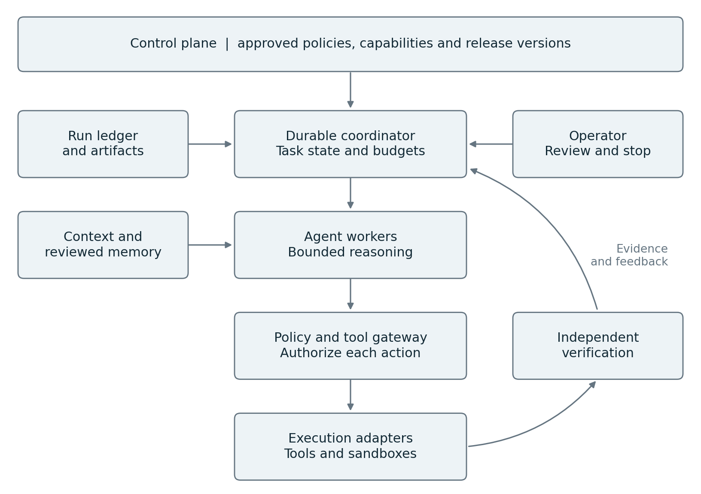
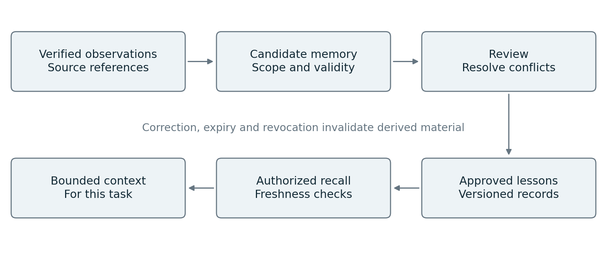
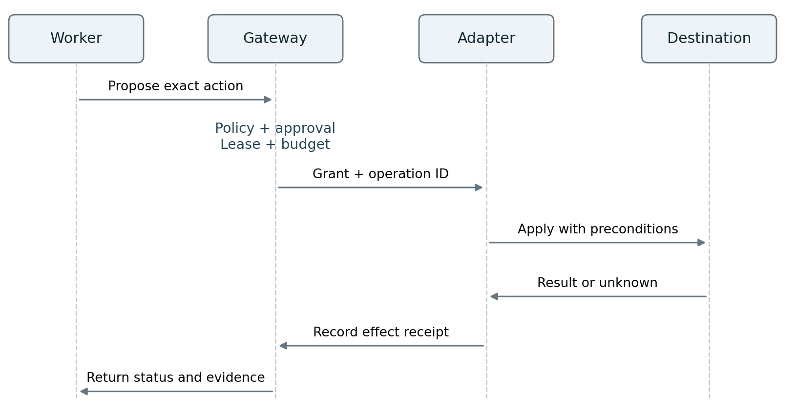
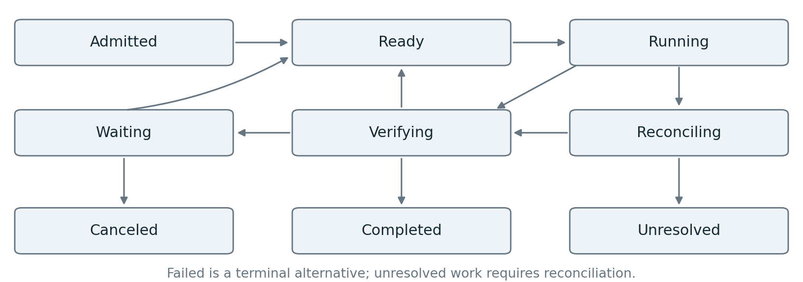
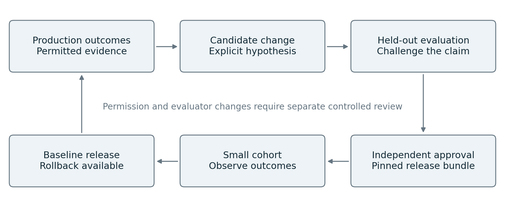
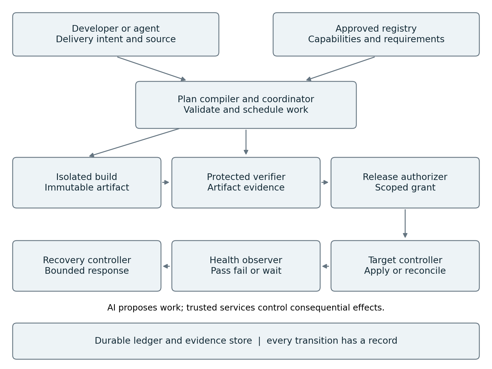
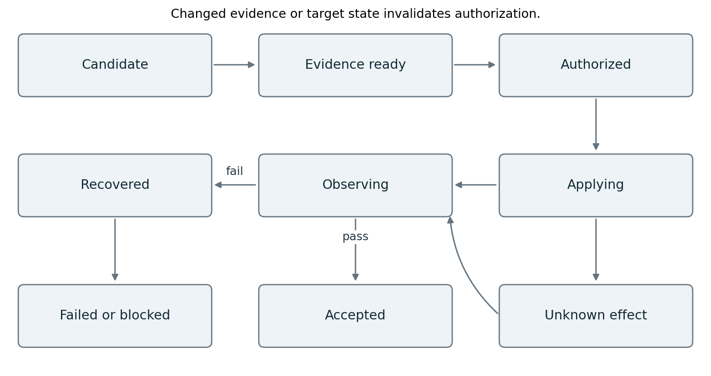
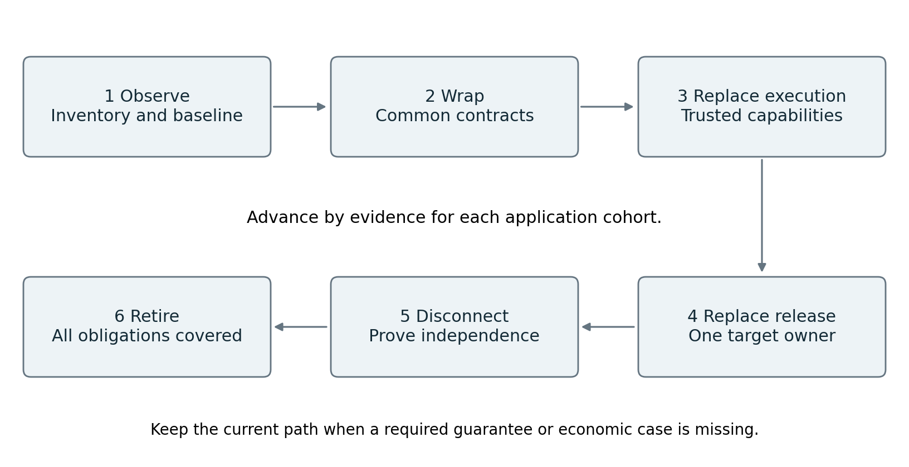
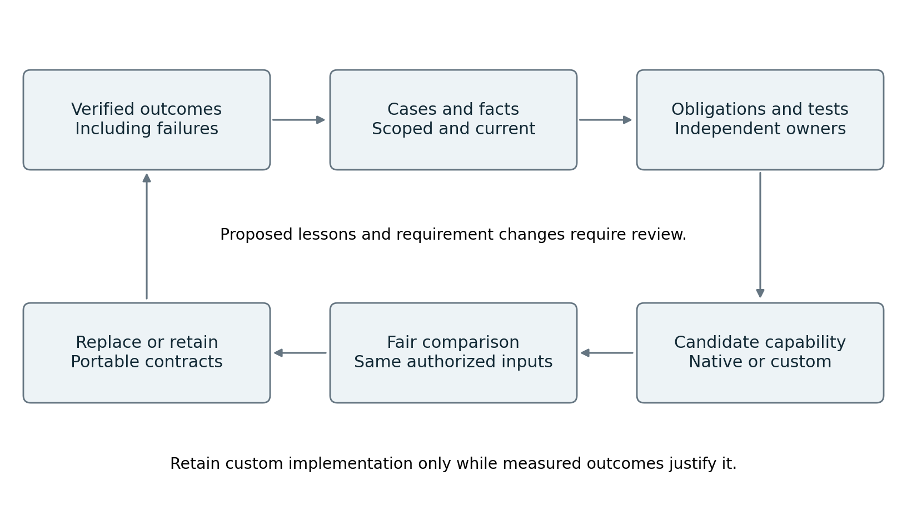

# Governed AI Workflows and the Future of Software Delivery

## Agent orchestration and a practical path beyond dedicated CI CD tools

Technical white paper | Version 2.0 | 3 October 2026

### Abstract

An enterprise agent platform must turn uncertain model decisions into useful, bounded and recoverable work. This paper proposes an architecture that combines durable workflow execution, selective delegation to agents, authorization at the point of action, governed memory and independent outcome verification. A separate improvement process tests changes before they alter production behavior.

The design separates responsibilities that evolve at different rates. Models, prompts, retrieval strategies and agent frameworks can change quickly. Identity, task ownership, evidence, authorization and recovery contracts remain comparatively stable. Explicit interfaces allow stronger models and new execution environments to enter without replacing the system of control.

The paper supplies component responsibilities, interface contracts, state transitions, failure handling, deployment patterns, acceptance tests and a staged build plan. It then derives a concrete delivery architecture that can make dedicated CI/CD products unnecessary for proven application cohorts. Build, test, authorization, deployment and recovery remain explicit capabilities; AI proposes work within their enforced boundaries. It distinguishes documented capabilities from proposed integration choices and experimental extensions. Public research supports the feasibility of the ingredients, but does not establish a universal best architecture or validate this complete design. Workload-specific experiments remain the deciding test.

A further requirement is continued value as AI platforms become able to reproduce custom software. The paper specifies portable operational knowledge, independent outcome evidence and a two-week replacement challenge. Custom components remain only while they outperform a practical alternative under comparable access and constraints.

Audience: platform architects, engineering leaders, implementation teams and evaluators responsible for systems that act across enterprise applications.

Scope: software agents performing digital work. Examples are hypothetical and vendor-neutral. This publication does not describe an organization's internal architecture or imply organizational endorsement.

<!-- page -->

# Reading guide

The recommended starting point is one durable job, one bounded agent, one controlled tool path and an independent acceptance check. Add parallel workers, advanced memory and adaptive routing only after they improve measured outcomes or satisfy a required control.

| Part | What the reader should learn |
| --- | --- |
| 1 to 3 | The recommendation, its evidence and the architectural responsibilities. |
| 4 to 7 | Which components to build, how to connect them and how work is delegated. |
| 8 to 12 | How context, memory, authorization, execution and recovery behave. |
| 13 to 17 | How to verify outcomes, evolve the system, scale it and integrate providers. |
| 18 to 21 | How a complete example works and how to implement and challenge the design. |
| 22 to 26 | Future extensions, operating ownership and implementation contracts. |
| 27 to 31 | Delivery without dedicated CI/CD tools, contracts, release controls and recovery. |
| 32 to 36 | Implementation modules, a worked release, migration gates and build backlog. |
| 37 to 42 | Replication pressure, durable value, additional wiring and the two-week challenge. |
| References | Primary sources and the limits of the claims they support. |

### How to interpret the claims

**Documented capability** means that a cited primary source describes an implementation or supported mechanism. It does not mean that the mechanism has been exercised in the reader's environment.

**Research finding** means a reported result for particular models, tasks and evaluation conditions. It should not be treated as an enterprise service-level guarantee.

**Proposed requirement** means a design decision made by this paper. The terms must and should express requirements of this proposed architecture, not a universal industry standard.

**Experimental extension** means an option that needs separate evidence before it receives consequential authority. The architecture provides a place to test it without requiring it for the initial platform.

### Research method and boundary

The evidence review prioritizes provider engineering reports, live product documentation, protocol specifications and original research. The core orchestration evidence was reviewed on 2 October 2026. The delivery extension, platform-replication research and selected foundational sources were checked on 3 October 2026. Sources include conflicting evidence about multi-agent effectiveness, memory benefits and evaluation reliability. Vendor reports are evidence of implementation; their performance claims are not independent replication. Dynamic documentation should be rechecked before procurement or implementation.

This paper is a design specification and research synthesis. It does not report a deployed prototype, a completed security assessment or measured results from the proposed system.

<!-- page -->

# Essential terms and a simple mental model

Imagine an operations team with a work order, a ledger, specialist staff, controlled equipment and an independent inspector. The work order defines success. The ledger survives staff changes. Specialists propose actions. Equipment permits only authorized operations. The inspector checks the actual result. Software delivery adds a controlled transition from a proposed change to a healthy running service.

| Term | Plain meaning |
| --- | --- |
| Agent | A model-driven worker that chooses actions using instructions, context and tools. |
| Workflow | A defined process for sequencing work, waiting and handling failure. |
| Orchestration | Assigning and coordinating work across workers and services. |
| Control plane | Software that defines approved configuration, authority and operating limits. |
| Durable | Recorded so work can recover after a process or machine fails. |
| Artifact and digest | An output such as code or a container, and a cryptographic identifier of its bytes. |
| Provenance | Evidence describing where an artifact came from and how it was produced. |
| Reconciliation | Comparing intended and observed state, then safely resolving the difference. |
| Idempotency | Repeating the same intended operation does not repeat its business effect. |
| Fencing token | An increasing ownership number used to reject a former worker after takeover. |
| Attestation | An integrity-protected statement by an identified producer about an artifact. |
| Canary | A limited rollout used to observe behavior before broader exposure. |
| Tenant and cell | A customer or organizational boundary, and a bounded execution deployment. |
| Held-out evaluation | Testing on cases not used to tune the candidate being evaluated. |

An agent decides what might help. A durable workflow records and coordinates the work. Policy decides whether an action is permitted. An executor performs it. Verification establishes what actually happened. These are different responsibilities even when a product packages several together.

The delivery extension in Sections 27 to 36 applies these responsibilities to software changes. It uses one contract from developer preflight checks through production observation. A reader can follow that example first and return to Sections 3 to 17 for the underlying mechanisms.

<!-- page -->

# 1 Recommendation and design principles

Build a system in which ordinary software owns durable state and authority, while models propose and execute bounded reasoning steps through controlled interfaces. In human terms, the platform maintains a work ledger, assigns specialists, checks access at the door and inspects completed work.

The objective is verified business value at acceptable cost, delay and risk. Agent count, token consumption and autonomy are implementation choices. They are poor success measures on their own. The system must also survive the economic challenge of a platform reproducing its features quickly. Sections 37 to 42 define the evidence and replacement mechanisms required to retain useful capabilities while retiring custom implementations that no longer add value.

### Deriving the architecture from the problem

A model operates with incomplete information and can choose an incorrect next step. Therefore, a job needs an explicit outcome contract and feedback from the actual environment. A persuasive explanation is insufficient evidence that a change worked.

Digital work crosses databases, APIs and execution environments that can fail independently. Therefore, progress must be recorded durably and external effects must have explicit retry and reconciliation semantics. A timeout cannot establish whether an action happened.

Tasks compete for attention, compute and human review. Therefore, plans need budgets, bounded delegation and termination rules. An agent that keeps improving an answer indefinitely can still fail the business objective.

Different parties possess different authority. Therefore, a worker's ability to reason must be separated from its ability to access data or change systems. Delegation must preserve or narrow the original authority.

Models and frameworks change faster than enterprise systems. Therefore, preserve stable contracts for jobs, artifacts, actions and evidence while treating the agent harness as replaceable. A harness is the software that assembles context, invokes a model and handles its proposed tool calls.

### Requirements that govern every component

1. Every consequential action belongs to an authenticated tenant, principal, run and task.
2. Every accepted result references verifiable evidence and the exact artifact examined.
3. Every retry has a defined effect on the destination system.
4. Every worker has a finite lease, deadline and resource allowance.
5. Every production release records the versions that determine its behavior.
6. Every learned lesson can be corrected, scoped and withdrawn.
7. Every job can reach an explicit completed, failed, canceled or unresolved state.
8. Every increase in autonomy has a measurable acceptance test.

These are proposed invariants. Their enforcement and failure tests appear throughout the implementation blueprint.

<!-- page -->

# 2 What current evidence establishes

OpenAI's agent guide and Anthropic's foundational guidance describe models using tools within an execution loop, with instructions and stopping conditions. They support a simple starting point rather than a mandatory multi-agent topology. [1, 2]

Research makes the topology decision conditional. Google Research reports 180 configurations across several tasks and model families. Centralized coordination improved a parallelizable financial reasoning workload, while multi-agent variants degraded a sequential planning workload by 39 to 70 percent. These are benchmark results, not predictions for a particular enterprise. [3]

The MAST research identifies failures in specification, inter-agent coordination, and verification or termination. It supports evaluating the whole system and classifying failures by mechanism, rather than assuming better role prompts will resolve every problem. [4]

| Evidence | What it establishes | What it does not establish |
| --- | --- | --- |
| Anthropic Managed Agents architecture [5] | Session history, harnesses and execution environments can be separated. | That any integration using this separation is reliable. |
| Temporal activity semantics [11] | Recovery and retries are available infrastructure capabilities. | Exactly-once effects in arbitrary downstream systems. |
| AWS AgentCore release notes [9] | Policy and Evaluations are generally available components. | Suitability for every jurisdiction, tenant or tool. |
| Managed multi-agent and outcome APIs [7, 8] | Delegation and bounded grading loops are implemented. | Independent security boundaries or infallible grading. |
| Hindsight research [16] | Structured memory improved tested conversational recall tasks. | Automatic improvement in production operations. |

Anthropic's managed service remains labeled beta in the reviewed documentation. Its multi-agent configuration separates conversational contexts but shares session execution resources; isolation must be assessed explicitly. AWS lists several AgentCore capabilities as generally available. Temporal's current changelog distinguishes general availability of Worker Versioning from preview features associated with it. [6, 7, 9, 12]

### The defensible claim

The architecture in this paper combines mechanisms that can be implemented today. Public evidence does not certify the combined design as the most advanced or best-performing system. The strongest practical design is the simplest configuration on the workload's quality, cost, latency and control frontier. That frontier must be measured again as models and requirements change.

<!-- page -->

# 3 Architecture and trust boundaries

The platform has a shared control plane and independently operated execution cells. A cell is a bounded deployment unit with its own scheduling, storage access and execution capacity. Cells can correspond to regions, trust tiers or groups of tenants.



The control plane publishes approved configuration and receives operational status. Each execution cell accepts authenticated work, records progress, assigns workers and mediates protected actions. A separate evidence path determines whether the outcome satisfies the job contract. The improvement service consumes permitted traces and proposes new versions.

A cell may continue already admitted work while the control plane is unavailable only under an explicit policy for configuration age and revocation freshness. Protected writes must stop when required authorization freshness cannot be established. A central dashboard outage must not be mistaken for a safe execution stop.

Logical responsibilities do not require a microservice per box. The first implementation can combine the intake API, registry and operator interface. Authorization, untrusted code execution and trusted evaluation need real trust boundaries even when the deployment is small.

The architecture follows the separation of durable sessions, replaceable harnesses and execution environments described by Anthropic, while adding explicit enterprise contracts around tenancy, outcome evidence and promotion. [5]

<!-- page -->

# 4 Components and ownership

The table defines the components to implement or integrate. The final column names the durable state for which each component is accountable. A database shared for convenience must still preserve these ownership boundaries.

| Component | Responsibility | Authoritative state |
| --- | --- | --- |
| Intake and contract service | Authenticate work and validate goal, scope and acceptance criteria. | Run contract and initiating principal. |
| Registry and release service | Publish approved agents, tools, policies and version bundles. | Immutable manifests and release pointers. |
| Durable coordinator | Own task dependencies, leases, retries, waits and transitions. | Run and task lifecycle. |
| Agent worker and model adapter | Assemble bounded context and propose actions or results. | No independent business truth; checkpoint references only. |
| Context and memory service | Retrieve permitted material and manage reviewed lessons. | Source indexes and memory records. |
| Authorization and tool gateway | Validate each protected action and narrow delegated access. | Decisions and operation receipts. |
| Execution adapters | Invoke destination APIs or isolated compute. | Destination handles and effect status. |
| Artifact and evidence service | Store immutable outputs and their lineage. | Content digests and verification records. |
| Evaluation and acceptance service | Run required checks and decide acceptance under policy. | Test outcomes and acceptance decision. |
| Operator interface | Explain status and accept authenticated interventions. | Commands recorded in the run ledger. |
| Telemetry and improvement service | Measure outcomes and propose changes. | Experiment and candidate release records. |

### What to build and what to reuse

Build the business contract, action semantics, evidence requirements, adapter conformance tests and operator decisions specific to the organization. Reuse mature identity, workflow, storage, queueing, secrets and observability systems where they satisfy the required semantics.

An agent framework can supply a worker harness. It should not accidentally become the authoritative system for approvals, durable business state and release governance. If one product supplies several components, validate each responsibility separately.

Assign a platform owner to lifecycle and isolation, a domain owner to tool effects and acceptance criteria, and a policy owner to delegated authority. The evaluation owner must have the ability to reject a release independently of the agent builder. These are required responsibilities; smaller teams may combine roles with explicit conflict controls.

<!-- page -->

# 5 Contracts that connect the components

All internal commands carry a versioned envelope. At minimum it contains tenant_id, run_id, task_id, message_id, causation_id, schema_version and an authenticated caller identity supplied by the transport. Tenant identity is derived from verified credentials and compared with the payload; a caller cannot select another tenant by editing JSON.

The run contract records the goal, allowed resources, acceptance specification, risk class, deadlines, budget and initiating authority. Each task contract adds dependency IDs, an input snapshot, output schema, worker capability requirements and an allocated budget. Delegated contracts can narrow scope, but cannot enlarge it.

| Contract | Producer and consumer | Required binding |
| --- | --- | --- |
| RunSpec | Intake to coordinator | Tenant, principal, goal, scope and acceptance version. |
| TaskSpec | Coordinator to worker | Run, dependencies, input digests, lease and budget. |
| ActionProposal | Worker to gateway | Task, tool version, target, arguments and expected resource version. |
| ActionReceipt | Adapter to ledger | Stable operation ID, external ID, effect state and evidence. |
| ArtifactManifest | Worker or adapter to artifact service | Digest, producer, inputs, classification and location. |
| EvaluationResult | Evaluator to acceptance service | Artifact digest, test suite version, outcomes and evidence. |
| ChangeProposal | Improvement service to release pipeline | Candidate changes, baseline, experiment and rollback plan. |

The appendix supplies concrete examples. These are proposed platform interfaces, not vendor API schemas.

### Transport and delivery semantics

Use synchronous calls when an immediate decision is required, such as action authorization. Use durable asynchronous messages for long-running work, task completion and approval events. Delivery is assumed to be at least once. Consumers deduplicate by message ID and reject invalid state transitions.

Commit task-state changes and an outbound event record in one transaction where possible. A dispatcher delivers that record and retries safely. A consumer records its deduplication result with the state change it causes. This prevents a database commit and message publication from drifting apart silently.

The workflow engine owns run sequencing. An enterprise event bus distributes notifications and integration events; it must not become a second competing run-state authority. Large artifacts travel by authenticated references and digests, not repeated copies in event payloads.

<!-- page -->

# 6 Durable execution and concurrency

A coordinator owns a run's dependency graph. Each task can be admitted, ready, leased, running, waiting, verifying or terminal. State transitions use a durable transaction or the workflow engine's event history. Agent messages alone do not change lifecycle state.

Only one valid lease holder may commit a task result. The coordinator issues a monotonically increasing fencing token when it replaces a worker. The gateway and result store reject writes from stale lease holders. This matters when a disconnected worker continues running after another worker takes over.

Model calls and external actions occur outside deterministic replay logic. The coordinator records their results as events or activity outcomes. Replaying orchestration history restores decisions already recorded; it must not silently ask a model to regenerate an old decision or repeat a completed external effect.

### Separating retries from new attempts

A transport retry resends the same operation identity and payload. A new reasoning attempt may change the plan or arguments and therefore receives a new attempt identity. A business action intended to happen once retains one business operation key across recovery. These identities must not be conflated.

Before spending resources, reserve a portion of the run budget for a task. Reconcile actual usage afterward. Reservations are atomic across parallel tasks. Billing can arrive late, so enforce a conservative headroom allowance and a hard limit on outstanding reservations.

### Handling parallel changes

Parallel workers can investigate independent questions or produce candidate artifacts. Shared mutable business resources require explicit coordination. Use immutable working copies, ownership of an artifact path, optimistic version checks or destination transactions. The coordinator rejects a result based on stale inputs when those inputs affect correctness.

A merge task resolves compatible changes and sends the combined artifact through verification. Passing each worker's separate test does not prove that the merged result works. Conflicting updates become an explicit replanning or human-review condition.

Temporal documents why retried activities can execute more than once and why idempotency must be implemented at the destination boundary. Its guarantees about workflow history do not create universal exactly-once business effects. [11]

Acceptance test: kill a worker after an external write, delay its completion message, then start a replacement. The system must identify the completed effect, reject stale commits and preserve one authoritative task outcome.

<!-- page -->

# 7 Planning and selective delegation

The planner chooses the next bounded piece of work. It may produce a dependency graph, but should avoid inventing a detailed plan for information that is not yet available. Plan a short horizon, execute, inspect results and revise the remaining graph through the coordinator.

The coordinator validates dependencies, allowed capabilities, budget, depth and termination conditions before admitting a plan revision. It records the reason for change as a concise decision summary with evidence links. Private internal model reasoning is neither required nor an adequate audit record.

### A practical routing policy

Use deterministic code for validated calculations and known procedures. Use one agent when the task has tightly coupled reasoning or shared context. Delegate independent investigations when their results can be combined through a clear contract. Consult a stronger model when a bounded subproblem exceeds the worker's demonstrated capability.

Route using measured task features such as tool requirements, dependency structure, input size and observed failure history. Model self-reported confidence can be an input to escalation, but must not independently authorize a consequential action.

Each subtask has an explicit question, evidence standard, owner, output schema and deadline. The parent receives concise findings with artifact references. Where results conflict, it preserves the disagreement and requests a targeted test rather than averaging incompatible claims.

### Avoiding coordination failure

Bound fan-out, recursion depth, simultaneous workers and repeated consultations. Detect duplicate investigations through task fingerprints and overlapping resource scopes. Cancel unnecessary work after sufficient evidence is available, while recording any unresolved consequential side effects.

For important decisions, assign a reviewer a specific disconfirmation objective: identify evidence that would make the proposed conclusion false. Supply original inputs and acceptance criteria without requiring the reviewer to adopt the creator's explanation.

Google's scaling research supports workload-dependent coordination. Anthropic's research-system report demonstrates a coordinator-worker implementation, while reporting substantially higher token use than ordinary chat and limits for tightly dependent work. These support controlled delegation, not unrestricted agent conversations. [3, 22]

Acceptance test: compare one agent, a fixed workflow and selective delegation on the same tasks. Keep delegation only where its quality, elapsed time or required independence justifies total cost, including evaluation and human effort.

<!-- page -->

# 8 Context assembly and governed memory

Context is the material presented to a model for one decision. The task journal is the durable record of what happened. Long-term memory is selected information reused across jobs. Keeping these separate makes both recovery and correction tractable.



The context service first applies identity, tenant, classification and resource filters. It then retrieves relevant source material, resolves freshness and conflicts, and assembles a bounded package. Each package records source IDs, versions, timestamps and transformation versions. Retrieved instructions from untrusted content remain data and do not gain authority over the work contract.

A summary references its source range and can be regenerated. Material required for approval, recovery or verification remains available in original form under its retention policy. Context compression cannot erase the only copy of business evidence.

A reusable memory record contains the observation, supporting evidence, applicable scope, valid time, source version, confidence provenance, sensitivity, reviewer and expiry policy. Facts, tentative inferences and recommended procedures have different record types. Multiple inconsistent observations can coexist until resolved.

A correction creates a superseding record and invalidates derived indexes, summaries and cached context as applicable. Deletion must propagate through searchable replicas and embeddings according to policy; append-only operational records retain only what the approved retention scheme permits. Immutable lineage does not mean perpetual retention of sensitive content.

Anthropic's context guidance supports selective retrieval and bounded context. LangGraph exposes separate checkpoint and cross-thread storage concepts. These capabilities provide implementation options for the proposed separation. [13, 14]

<!-- page -->

# 9 Memory implementation and Hindsight integration

A memory backend is replaceable behind four platform operations: retain candidate evidence, recall permitted records, propose a reflection and correct or retire a record. The authorization and approval semantics belong to the platform contract even when a backend offers similar features.

Hindsight exposes retain, recall and reflect operations and supports configurable memory banks and mental models. It is a concrete candidate for the memory backend. [15] The reviewed paper reports 83.6 percent on LongMemEval for one 20B-model configuration versus 39.0 percent for its full-context baseline. This is a conversational-memory benchmark, not a demonstrated reduction in operational incidents. [16]

### Wiring the memory path

After a task completes, the evidence service emits an authorized observation event. A memory adapter submits eligible evidence to the backend under a tenant-specific namespace. Retention policy determines whether raw data, extracted facts or only references may be stored. A successful operation receipt is linked to the source event so retries cannot create uncontrolled duplication.

Before a later task, the context service calls recall with caller scope, source freshness requirements and a token budget. Returned candidates pass platform authorization and provenance checks before entering context. Similarity scores rank candidates; they do not establish truth or permission.

Reflection runs as a separate bounded job. Its output is a proposed lesson, including supporting and conflicting observations. A review process may promote that lesson to a shared playbook. The reflection process cannot alter authorization policy or the acceptance standard that judges its own usefulness.

### Experiments required before promotion

Compare source retrieval alone, raw episode retrieval and structured reflection on held-out tasks. Measure verified task success, stale-memory error rate, retrieval latency and total cost. Inject a false observation, change an underlying fact and revoke source access. Confirm that correction and access withdrawal affect future retrieval.

Do not use a vector store as the authoritative task ledger. Vector similarity is useful for finding candidates; durable transitions, approval bindings and operation reconciliation require exact identifiers and transactional semantics.

The first release can use a relational store and a small source index. Advanced memory becomes justified when cross-run knowledge is necessary and the controlled experiment demonstrates benefit.

<!-- page -->

# 10 Authorization and action execution

An action proposal names the tool version, target resource, arguments, intended effect, artifact digest and expected resource version. The gateway resolves authority from authenticated identity, the run contract, delegated scope and current policy. It does not trust an agent's statement that approval exists.



Approval is bound to the exact action or explicitly bounded class of actions. The record includes approver identity, scope, expiry, relevant artifact digest and preconditions. If the artifact or destination changes materially, the approval becomes stale and must be reevaluated. A generic conversation reply is insufficient unless the application securely binds it to the pending request.

The gateway reserves budget, checks revocation and issues a short-lived execution grant. The adapter rechecks destination preconditions at execution using a version token, transaction or other supported mechanism. Systems unable to enforce those checks require conservative serialization or explicit acceptance of the residual race.

An operation receipt records whether the effect is confirmed successful, confirmed failed, not started or unknown. Unknown effects enter reconciliation and cannot be accepted as success or blindly retried.

AWS AgentCore documents external gateway policy evaluation and session-aware conditions. MCP security guidance prohibits token passthrough and explains confused-deputy risks. These support placing authorization in trusted infrastructure and validating token audiences. [10, 17]

Keep service credentials out of generated-code environments. A broker can invoke permitted operations on the worker's behalf using narrow credentials. Network controls must prevent access to the same protected destination through an unmediated path. A gateway cannot control traffic that bypasses it.

<!-- page -->

# 11 Isolation and threat containment

The threat model includes hostile retrieved documents, malicious tool output, compromised plugins, accidental overreach, stolen credentials, poisoned memory and cross-tenant access. It also includes authorized actions that become harmful in combination or through repetition.

Use isolated execution environments for generated code, with restricted filesystems, network destinations, resource limits and no ambient production credentials. Separate context windows help reduce interference, but they are not a security boundary. The reviewed managed multi-agent documentation explicitly shares session execution resources. [7]

### Controls along the entire path

Intake authenticates the initiating principal and classifies the job. Retrieval filters sources before material enters the model. Tool registration validates schemas, destination ownership and effect categories. The gateway mediates protected reads as well as writes, since data disclosure can itself be consequential. Artifact handling scans or quarantines untrusted outputs before consumption.

The worker treats all external text as potentially adversarial. Prompt instructions and classifiers are useful defense layers, but cannot substitute for destination permissions or network restrictions. An agent may misunderstand the task despite passing a content check.

Delegation grants intersect the parent's scope, the worker capability profile and destination policy. A child cannot request a broader identity merely because the parent describes the work as urgent. External agents receive only the artifacts and authority required for their contract.

### Interruption and emergency revocation

An authenticated stop command increments a run revocation epoch, blocks new leases and revokes further protected actions. Gateways check that epoch with defined freshness. Workers also receive cancellation and execution environments are terminated where appropriate. During a partition, a protected action is denied when required freshness cannot be verified.

Track requested stop, acknowledged stop and confirmed containment separately. Cancellation of a process does not undo a sent message, committed database change or accepted downstream deployment. The operator must see outstanding external effects and any required compensation.

Acceptance tests attempt data exfiltration through allowed-looking tool calls, replay an expired approval, bypass the proxy, submit a stale lease and ask a child agent to expand authority. Passing a test suite narrows known risk; it does not establish immunity to every prompt injection.

<!-- page -->

# 12 Recovery and explicit run states

Durability protects the work ledger. Recovery also needs destination-aware reconciliation, compatible code versions and an operator path for effects that cannot be established automatically.



| Failure | Required behavior |
| --- | --- |
| Model timeout before an action | Retry within budget or escalate; preserve the input snapshot. |
| Worker lost after external request | Mark effect unknown; query destination by operation ID. |
| Duplicate completion event | Deduplicate; do not advance the task twice. |
| Approval arrives after expiry | Record it as stale and request reevaluation. |
| Verification unavailable | Keep the outcome unaccepted and expose the blocking reason. |
| Destination cannot confirm an effect | Enter unresolved state with an operator reconciliation task. |
| Release changes while a run is active | Continue pinned compatible behavior or use an explicit migration. |

Compensation is a new controlled action, not a database rollback across all systems. Some effects can be reversed, some can be offset, and some require remediation. Each adapter declares its compensation method, limits, authorization requirements and evidence of completion.

Persist the worker implementation, model identifier, prompt version, tool schema versions and policy decision version relevant to each attempt. A replay can reproduce the recorded sequence without reproducing identical model output. Provider-side model changes may make exact behavioral reproduction impossible; the run record should make that limitation visible.

Temporal supports versioned worker deployments and gradual traffic changes. The reviewed changelog separately labels some upgrade and autoscaling features as preview, so implementation must check exact feature maturity. [12]

The unresolved state is intentional. Declaring uncertainty prevents the platform from converting incomplete evidence into a false claim of success.

<!-- page -->

# 13 Outcome verification and evidence

Verification answers whether the required outcome exists and respects the work contract. It examines the result in the environment, not only the worker's report. A test that merely repeats the implementation's assumptions can pass while the intended behavior remains wrong.

Create acceptance specifications before execution where possible. Bind each evaluation to the artifact digest, relevant destination state, suite version and evaluator implementation. Prevent the creator from editing protected acceptance tests or substituting a different artifact after approval.

### Different checks serve different purposes

Schema checks establish that an output is well formed. Executable tests establish selected behavioral properties. Policy checks establish whether actions and outcomes satisfy encoded constraints. Source checks establish whether factual claims have appropriate support. Human judgment resolves consequential ambiguity that automated checks cannot adequately decide.

An AI grader can assess open-ended qualities against a rubric. Its results should be calibrated against human review and challenged with seeded errors. A different model or separate context may reduce some shared bias, but does not guarantee independent errors. Anthropic documents both outcome graders with separate contexts and a broader approach combining automated evaluation, monitoring and human review. [8, 21]

### Evidence records

Store the run and task IDs, artifact digest, input lineage, tool receipts, test observations, evaluator versions, acceptance outcome and approval references. Record concise reasons and external observations. Hidden chain-of-thought is unnecessary for this audit contract.

Sign or otherwise protect evidence according to the threat model. A signature proves the origin and integrity of an assertion when its signer is trusted; it does not make the assertion correct. Keep the evaluator and its signing authority outside the creator's control.

SLSA provenance provides a model for recording how software artifacts were produced. Use its actual format where applicable to builds. Agent task outcomes need their own explicitly defined evidence schema; attaching a provenance file does not by itself establish a SLSA level or the correctness of a business result. [20]

An accepted outcome can later regress as the environment changes. Long-lived outcomes therefore need an observation window or ongoing domain monitoring. For a deployment, acceptance can require both initial tests and sustained health, with separate recovery handling if health deteriorates later.

<!-- page -->

# 14 Improvement through a separate release process

The system should learn from verified outcomes while preserving a controlled production baseline. Improvement jobs consume permitted evidence, classify failures and propose changes. They do not receive automatic authority to redefine success, expand permissions or overwrite the current production configuration.



Three kinds of adaptation require different handling. In-run replanning changes the remaining work within an existing contract. Memory updates change what later jobs can retrieve. Release updates change code, prompts, tools, routing, models or evaluation behavior. Each has a separate owner, version and rollback path.

Every candidate names a falsifiable hypothesis: for example, a smaller tool catalog will reduce wrong-tool selection without reducing completion. The experiment changes as few variables as possible. Keep a frozen baseline, held-out tasks and prior failure cases. Repeated trials measure variability rather than celebrating one successful run.

A change to an evaluator receives its own validation. Evaluate candidate agents under the established standard before replacing that standard. If both must change, report both comparisons and require explicit review so an easier grader cannot manufacture improvement.

Release bundles pin compatible versions of the harness, model profile, prompts, tools, context transformation, memory policy, evaluator suite and authorization policy. New traffic can move gradually to a candidate. Existing work remains on compatible pinned behavior unless an explicit migration is tested.

Monitor verified completion, escaped defects, unauthorized action attempts, intervention burden, cost and elapsed time. Roll back the release pointer when thresholds are violated; separately reconcile effects already produced. Reverting a prompt cannot retract an external transaction.

Current evaluation and worker-versioning mechanisms support pieces of this process. The complete promotion workflow is a proposed integration responsibility. [12, 21]

<!-- page -->

# 15 Scaling across tenants and regions

Scale execution cells horizontally and keep tenant identity present throughout storage, queues, tool access, telemetry and memory. A cell boundary contains a failure; a tenant boundary controls authority and data. They can overlap, but they are not interchangeable.

Use explicit admission control before work starts. Allocate model concurrency, worker slots, tool quotas and cost budgets by tenant and workload class. Reserve some capacity for reconciliation, cancellation and recovery so overload does not prevent the system from restoring control.

### Isolating resource contention

Separate interactive jobs from long-running background work. Apply fairness to queue scheduling and prevent an agent's recursive fan-out from consuming the cell. Limit outstanding tool calls and retries during downstream outages. Exponential backoff with jitter is useful for transient errors; repeated semantic failures require replanning or stopping.

Large outputs belong in artifact storage. Store structured ledger records in a transactional system and keep indexes rebuildable. Partition by tenant and run while enforcing ownership checks in the application and storage layers. Data residency requirements apply to model calls, memory, artifacts, logs and backups, not only the primary database.

### Recovery across regions

Define recovery time and acceptable data loss separately for task history, artifacts and observations. For consequential writes, a recovered region must obtain current fencing and revocation authority before executing. Never allow both regions to believe they own the same live run without a conflict protocol.

Failover may resume orchestration while still requiring destination reconciliation. The recovered journal can be behind the external system. Test disaster recovery with real adapter semantics, not only database restoration.

### Avoiding a global bottleneck

The shared control plane distributes approved manifests and policy versions. Execution cells enforce them locally with bounded freshness. Cross-cell work passes a delegated contract and artifact references through an authenticated interface. The global dashboard aggregates status; it is not the transaction manager for every tool call.

For an initial pilot, one cell and one tenant are sufficient. Add tenant isolation tests before onboarding a second tenant and regional failover tests before claiming a recovery guarantee.

<!-- page -->

# 16 Interoperability and replaceable providers

The platform's stable contracts describe what a component must do, not which framework implements it. An agent worker adapter receives a task, executes within a capability envelope and returns actions, artifacts or a terminal result. The coordinator retains lifecycle ownership when the worker implementation changes.

| Boundary | Contract to preserve | Candidate mechanism |
| --- | --- | --- |
| Model invocation | Input, output, usage, cancellation and error mapping. | Provider API adapter. |
| Tool invocation | Typed arguments, authority, operation ID and receipt. | Direct API or MCP behind a controlled gateway. |
| Remote agent work | Task state, artifacts, authorization and cancellation. | A2A adapter where supported. |
| Agent telemetry | Correlation IDs, events, cost and redaction. | OpenTelemetry adapter. |
| Artifact lineage | Digest, producer, inputs and verification. | Object manifests and applicable attestations. |

MCP supplies a tool-integration protocol with explicit security requirements. It does not supply the business approval policy or safe retry semantics for every tool. A2A supplies task and artifact exchanges, including interrupted states and authorization flows. Receiving a remote completed status does not establish that the local acceptance criteria were met. [17, 18]

Normalize each provider's completion, error and cancellation semantics. A cancellation request may be advisory, and streaming completion may precede durable artifact availability. Contract tests must exercise those differences rather than assuming that similar method names imply identical behavior.

Pin protocol and schema versions in manifests. Maintain compatibility tests against supported versions and fail closed on unknown security-critical fields. Use an extension namespace for optional capabilities. An adapter must advertise unsupported capabilities explicitly; it must not silently emulate a stronger guarantee.

OpenTelemetry's GenAI conventions are in active development, and the reviewed documentation points to evolving specification locations. Preserve a stable internal event model and map it to the selected convention version. [19]

A portability test runs representative tasks through a second model or worker adapter without changing the work contract, acceptance criteria or authority boundary. Model quality can change; the meaning of permission and accepted evidence must remain consistent.

<!-- page -->

# 17 Observability and operator experience

The operator should be able to answer five questions: what is the system trying to achieve, what has happened, what is happening now, what authority remains, and what evidence is missing? A stream of agent messages alone does not answer them reliably.

Provide a run view with the approved goal, task graph, current state, budget consumption, pending approvals and latest verified observations. Show blocked work and unknown effects prominently. Link every action to its tool receipt and every claimed outcome to its verification record.

### Measurements that drive decisions

| Measurement | Definition and use |
| --- | --- |
| Verified completion rate | Accepted outcomes divided by eligible runs; report task mix. |
| False acceptance rate | Known failing outputs accepted by the checker in an adjudicated set. |
| Escaped defect rate | Accepted outcomes later found defective within a defined observation window. |
| Cost per verified outcome | All task, retry, evaluation and allocated review cost divided by verified outcomes. |
| Time to accepted outcome | Wall time including queues, approvals and retries; report median and tail. |
| Intervention burden | Human minutes and interventions per run, by reason. |
| Containment time | Stop request to confirmed prevention of further protected actions. |
| Unknown effect backlog | Unreconciled operations by age, destination and risk. |

Separate platform availability from agent correctness. A responsive API can return poor decisions; a successful task can still violate authority. Likewise, count attempted prohibited actions separately from actions that actually escaped controls.

Correlate intake, model, retrieval, tool, evaluation and release events with run and task IDs. Redact sensitive content before telemetry export. Store content snapshots only where justified by policy; use digests and references elsewhere. Observability must not create a second uncontrolled repository of confidential data.

The operator interface exposes pause, cancel, approve, reject, narrow scope, retry after reconciliation and request human ownership. Actions are authenticated commands with an audit record. It must not offer an unlogged override that allows the agent to resume under broader authority.

Treat quantitative thresholds as workload-specific policy. Establish them during the pilot and report their basis. This paper does not invent a universal acceptable defect rate or guaranteed cost reduction.

<!-- page -->

# 18 End to end example of a deployment repair

Consider a hypothetical request: investigate a failed deployment and prepare a reviewed fix. The initial authority allows reading relevant logs, editing a branch, running tests and opening a pull request. It does not include production deployment.

### Admission and investigation

Intake authenticates the requester and validates repository access. The contract records the affected service, failure evidence, required tests, deadline and budget. The coordinator snapshots the input revision and admits a read-only investigation task.

The worker retrieves deployment logs and current configuration through approved tools. It records two competing hypotheses: a missing configuration value and an incompatible dependency. The coordinator delegates only the independent dependency check. Both workers return evidence references, including facts that weaken their preferred explanation.

### Change and verification

The evidence supports a missing configuration value. A worker edits an isolated branch and produces an artifact manifest. Independent checks reproduce the original failure, confirm the new behavior and run the required regression suite. A reviewer examines whether the proposed fix merely hides the symptom.

The gateway authorizes creating the pull request for the verified commit digest. If the API response is lost after creation, the operation becomes unknown. The adapter searches by its stable operation marker and discovers the existing pull request. It records that receipt without opening a duplicate.

### Acceptance and later deployment

The run is accepted when the contract's repair deliverable and evidence are complete. Opening a pull request does not imply approval to merge. A later merge or deployment is a separate explicitly authorized action, bound to the artifact that passed the applicable checks.

If the target branch changes, integration and verification run again for the resulting artifact. Prior approval cannot silently transfer to different content. If an operator interrupts during deployment, the platform blocks further protected actions and reconciles any already accepted downstream operation.

### Learning from the event

The evidence service proposes a scoped lesson about the configuration requirement. The lesson records service and version applicability. A memory review decides whether it is reusable. A broader enhancement, such as a preflight configuration check, becomes a versioned change proposal and follows the release process.

This example demonstrates how planning, execution, authorization, recovery, evidence and learning connect without requiring every stage to be a separate AI agent.

<!-- page -->

# 19 Implementation roadmap and release gates

Build complete vertical slices. A slice should accept a real task, perform a permitted action, verify an outcome and expose its failure behavior. Component demonstrations in isolation do not establish a working platform.

| Stage | Build or integrate | Exit evidence |
| --- | --- | --- |
| 0 Define the workload | Representative tasks, work contracts, tool effects and baseline. | Fixed workflow and single-agent baseline measured on held-out cases. |
| 1 Establish the core | Intake, durable coordinator, one worker, one adapter, artifact store and verifier. | Crash recovery, duplicate delivery and correct acceptance demonstrated. |
| 2 Control consequential actions | Identity, scoped gateway, approvals, revocation and reconciliation. | Bypass, stale approval and unknown-effect tests pass. |
| 3 Add selective delegation | Task contracts, bounded parallelism, merge and conflict handling. | Delegation improves chosen metrics under comparable budgets. |
| 4 Add governed memory | Source lineage, correction, retention and optional memory backend. | Stale and poisoned memory tests pass; held-out benefit demonstrated. |
| 5 Operate multiple tenants | Quotas, isolated storage access, cell scheduling and operator controls. | Cross-tenant and overload tests pass; recovery objectives demonstrated. |
| 6 Evolve safely | Experiment service, release bundles, canary routing and rollback. | A candidate upgrade can be evaluated, released and withdrawn safely. |

Do not attach fixed calendar promises before estimating integration complexity. Destination APIs, acceptance tests and identity integration often determine the critical path. Staffing should include workflow engineering, domain adapter ownership, evaluation engineering and security review, with operational ownership established before production.

### First useful release

A credible first release handles one bounded task class with one provider and one execution cell. It includes the failure path, not just a successful demonstration. Parallel agents and sophisticated memory are optional at this stage.

Stage completion does not automatically increase autonomy. Authority expands only for a specified action class after the corresponding evidence and operating owner are in place. A platform can support autonomous analysis while retaining approval for production changes.

<!-- page -->

# 20 Reference implementation choices

One feasible stack combines a durable workflow engine, a relational ledger or read model, object storage, a worker harness, an authorization service and an isolated executor. The exact products remain replaceable behind the contracts already defined.

| Responsibility | Practical candidate | Selection question |
| --- | --- | --- |
| Durable orchestration | Temporal or an equivalent workflow service. | Are recovery, timers, cancellation and versioning adequate? |
| Worker harness | LangGraph, a provider SDK or a small custom loop. | Can it obey the task and action contracts without owning business authority? |
| State and artifacts | Transactional database and object storage. | Are ownership, retention, digests and restoration testable? |
| Policy enforcement | AgentCore Policy or an equivalent external policy service. | Can it enforce resource, parameter, history and revocation conditions? |
| Memory | Source index and relational records; optional Hindsight adapter. | Does it improve task outcomes while supporting correction and isolation? |
| Execution | Isolated containers, microVMs or managed sandboxes. | Are credentials, filesystem and egress boundaries enforceable? |
| Evaluation | Code-based tests, domain checks and calibrated model graders. | Can known defects defeat the checker? |
| Telemetry | OpenTelemetry-compatible collection and internal outcome records. | Can events be correlated and redacted without losing accountability? |

These are implementation candidates, not a tested compatibility matrix or procurement ranking. Each combination requires adapter and security conformance testing. Managed features may reduce implementation effort while changing data-retention, residency, networking and maturity constraints. [6, 9, 11, 13, 15, 19]

### Avoid duplicating state machines

If Temporal owns the run lifecycle, use the worker framework for bounded reasoning sessions and local state. Do not let both frameworks independently retry the same consequential action. If a graph framework is the durable coordinator, validate that its production persistence and recovery semantics satisfy the same contracts.

Keep a tool-specific adapter catalog. Each entry states whether the operation is read-only, idempotent, compensatable or potentially irreversible. The entry also identifies external status lookup, approval requirements, supported cancellation, evidence checks and the owning team.

Choose a smaller stack when one service already provides the required behavior. Every extra integration introduces another failure mode and operating burden.

<!-- page -->

# 21 Disconfirmation and acceptance experiments

The design earns confidence by surviving targeted attempts to falsify its claims. The following experiments are release requirements for the relevant capability, not proof of universal safety.

| Hypothesis | Experiment | Rejection signal |
| --- | --- | --- |
| Delegation adds value | Compare fixed workflow, single agent and selective delegation. | Extra coordination costs exceed demonstrated benefit. |
| Recovery avoids duplicate effects | Crash after destination success but before receipt persistence. | A second unintended effect occurs. |
| Authority is contained | Inject hostile content and attempt alternate network paths. | A protected action bypasses the intended boundary. |
| Approval is specific | Change artifact, arguments, target version or expiry. | Stale approval still authorizes execution. |
| Memory helps | Introduce stale facts and contradictory lessons. | Failures increase or withdrawn material remains usable. |
| Verification is independent | Seed plausible defects and misleading explanations. | Checker accepts known failing outcomes. |
| Stop is effective | Interrupt during parallel work and network partitions. | Protected actions continue beyond the declared bound. |
| Upgrades preserve behavior | Resume older runs after a new release and after rollback. | Replay breaks or behavior changes without migration. |
| Tenants are isolated | Reuse IDs, caches and artifact references across tenants. | Unauthorized data or execution crosses the boundary. |

### Experimental protocol

Select a representative task set stratified by dependency structure, tool effects, input quality and risk. Keep development cases separate from held-out evaluation and adversarial cases. Compare both matched-budget performance and the cost required to reach the same quality target.

Repeat stochastic tasks and report uncertainty, task counts and failed or censored runs. Include human review time and recovery work. A benchmark result that excludes failed attempts can make an expensive or unreliable system appear efficient.

Pre-register the acceptance thresholds and the material improvement required before examining candidate results. For rare failures, zero observed failures in a small sample is weak evidence. Under independent identical trials, zero failures in 300 tests gives only an approximate 95 percent upper bound of one percent using the rule of three; real agent runs may be correlated and need stronger analysis.

Publish failure categories and counterexamples with each release decision. MAST provides a research taxonomy that can help organize coordination failures, but domain-specific effect and authorization failures require additional categories. [4]

<!-- page -->

# 22 Supporting future capabilities

Future compatibility comes from stable obligations and replaceable implementations. Keep task identity, authority, artifacts, evidence and recovery semantics stable while allowing models, harnesses and retrieval strategies to improve.

| Possible development | Extension point | Evidence required before consequential use |
| --- | --- | --- |
| Stronger models need fewer planning steps | Replace model or harness profile. | Equal or better held-out outcomes with simpler orchestration. |
| Longer context windows | Replace context selection and compression. | Accuracy and cost improve without access or retention violations. |
| External specialist agents | Add remote-agent adapter. | Identity, task state, artifact and cancellation conformance. |
| Persistent adaptive memory | Add reviewed memory strategies. | Transfer benefit, correction and poisoning resistance. |
| Learned task routing | Replace bounded routing policy. | Offline comparison and controlled online validation. |
| New execution environments | Add tool or sandbox adapter. | Effect semantics, isolation and evidence remain enforceable. |
| Automatic code or prompt optimization | Add a candidate generator. | Independent evaluations, provenance and rollback pass. |

Anthropic's managed architecture notes that harness workarounds can become unnecessary as models improve. This motivates regular removal experiments: turn off a specialized planner, reset heuristic or reviewer and measure whether it still earns its complexity. [5]

### Boundaries for self improvement

Controlled improvement is feasible: an agent can identify failures, propose changes, execute experiments and prepare a candidate release. Open-ended recursive self-improvement that autonomously changes its objectives, authority and evaluation system is not established as a reliable production requirement by the reviewed evidence.

The proposed platform keeps promotion authority outside the component being improved. An optimizer cannot approve its own evaluation change, increase its spending ceiling or grant itself a new tool. New capabilities enter through versioned manifests and explicit experiments.

Future federated systems may involve agents owned by different organizations. Treat those agents as external services with contractual obligations and bounded trust. Protocol compatibility cannot establish shared intent, correctness or legal authority.

Review architecture decisions when a model changes, a workload changes or repeated failures identify an unsupported assumption. Preserve the evidence for retiring as well as adding components.

<!-- page -->

# 23 Operational responsibilities and adoption

The platform succeeds when people can understand, operate and correct it. A sophisticated orchestration graph is insufficient if no team owns a destination's effect semantics or knows how to reconcile an uncertain action.

| Owner | Required responsibility | Artifact maintained |
| --- | --- | --- |
| Domain product owner | Define useful outcomes and acceptable tradeoffs. | Work contract and acceptance thresholds. |
| Platform engineering | Maintain execution, tenancy, storage and lifecycle guarantees. | Architecture, recovery tests and service objectives. |
| Tool owner | Define effects, preconditions, retry and compensation. | Adapter contract and conformance suite. |
| Policy owner | Set delegated authority and exceptions. | Versioned policy and approval rules. |
| Evaluation owner | Challenge outcomes and release claims. | Held-out suites and adjudicated defects. |
| Operations | Respond to failures and exercise containment. | Runbooks and recovery evidence. |
| Data and memory owner | Control source access, retention and correction. | Provenance and deletion policy. |

### Human review that preserves attention

Present the proposed action, changed artifact, expected effect, supporting evidence and unresolved risks together. The reviewer should not reconstruct a decision from a long transcript. Clearly distinguish approving one action from approving a recurring class of actions.

Reduce repeated approval only after the action class has bounded authority and demonstrated behavior. Track whether reviews are meaningful through rejected proposals, detected defects and review effort. A high approval rate can reflect either good proposals or ineffective review.

### Incident response

An incident runbook identifies the relevant tenant and release, stops new protected actions, inventories uncertain effects, preserves permitted evidence, reconciles destinations and selects recovery or compensation. It then creates a failure case for the evaluation suite.

Run periodic exercises for expired credentials, unavailable verifiers, malicious source documents, poisoned memories, broken model adapters and regional recovery. Measure operator time as well as technical recovery time.

The go-live decision requires an accountable owner for each consequential tool and an explicit response for unknown effects. Begin with a narrow outcome where evidence can be checked well, then expand coverage based on the observed failure profile.

<!-- page -->

# 24 Implementation contract examples

These examples define proposed internal interfaces. Values and identifiers are illustrative. They are not credentials, deployed endpoints or schemas supplied by a vendor.

### Run contract

```json
{
  "schema_version": "1.0",
  "tenant_id": "tenant-example",
  "run_id": "run-1042",
  "goal": "Prepare a verified deployment repair PR",
  "scope": {"repository": "example/service", "writes": "branch-only"},
  "acceptance_spec": "repair-pr-v3",
  "release_bundle": "agent-platform-1.4.2",
  "limits": {"max_tasks": 12, "max_parallel": 3, "deadline_seconds": 1800},
  "budget": {"currency": "USD", "maximum": 20},
  "approval_policy": "branch-repair-v2"
}
```

The intake service adds the authenticated principal and records the validated policy snapshot. Currency and resource limits are example settings, not recommended universal defaults. Relative deadlines are converted to an authoritative absolute deadline at admission.

### Action proposal

```json
{
  "run_id": "run-1042",
  "task_id": "task-7",
  "attempt_id": "attempt-2",
  "operation_id": "repair-pr-1042",
  "tool": "repository.create_pull_request",
  "tool_version": "2.1",
  "artifact_digest": "sha256:EXAMPLE_DIGEST",
  "expected_resource_version": "EXAMPLE_COMMIT",
  "lease_epoch": 8,
  "arguments_ref": "artifact:action-arguments-7"
}
```

The gateway resolves the referenced arguments, validates their digest and schema, and binds any approval to the resolved action. The operation ID is stable for retries of the same intended effect. Changing the arguments under that ID must be rejected.

<!-- page -->

# 25 Execution and evidence contracts

### Action receipt and evaluation

```json
{
  "operation_id": "repair-pr-1042",
  "effect_state": "confirmed_success",
  "external_resource_id": "pull-request-73",
  "policy_decision_id": "decision-881",
  "evidence_refs": ["artifact:destination-observation-73"]
}
```

Allowed effect states are not_started, confirmed_success, confirmed_failure and unknown. Each tool contract defines how a destination observation establishes the state and what partial success means for that operation.

```json
{
  "evaluation_id": "eval-502",
  "subject_digest": "sha256:EXAMPLE_DIGEST",
  "suite_version": "repair-pr-v3",
  "checks": [
    {"id": "reproduce-failure", "result": "pass"},
    {"id": "regression-suite", "result": "pass"}
  ],
  "evidence_refs": ["artifact:test-log-502"],
  "decision": "accept",
  "evaluator_version": "verifier-2.0"
}
```

Acceptance must check that all required checks are present, current and bound to the subject. It rejects missing, unsupported or inconclusive required results. An authenticated trusted evaluator supplies identity; an agent cannot establish that identity by populating a field.

### Minimum API surface

Provide create run, get run, append authenticated intervention, claim task, propose action, record receipt, reconcile operation, submit artifact, evaluate artifact, propose memory, correct memory and propose release. Each mutation requires authorization, a stable request identity and an expected version where concurrent state changes matter.

Return typed errors for denied, expired, stale, budget_exhausted, conflict, dependency_unavailable and effect_unknown. Those errors drive different behavior. In particular, a denied action must not be retried under another tool identity to obtain the same prohibited effect.

<!-- page -->

# 26 Data model and adapter conformance

The following logical records provide an implementation starting point. Storage can be consolidated, but authoritative ownership and transaction boundaries must remain explicit.

| Record | Identity and critical fields |
| --- | --- |
| Run | tenant_id plus run_id; contract, state, release bundle, deadline and revocation epoch. |
| Task | run plus task_id; dependencies, input versions, lease, attempt, state and budget reservation. |
| Operation | tenant plus operation_id; canonical argument digest, tool, target, receipt and reconciliation state. |
| Approval | approval_id; principal, action digest or bounded scope, expiry and revocation status. |
| Artifact | content digest; tenant, classification, location, producer and source references. |
| Evaluation | evaluation_id; subject digest, suite, observations, decision and evaluator identity. |
| Memory | memory_id and version; source, scope, validity, supersession and retention. |
| Release | release_id; compatible component versions, experiments, approvals and rollback target. |

Use uniqueness constraints for deduplication and compare-and-set transitions for concurrency. Protect object downloads through scoped authorization; knowing an artifact's digest or URL is not sufficient permission. Keep derived dashboards and search indexes rebuildable from authoritative records.

### Required adapter tests

Every consequential tool adapter must demonstrate schema rejection, identity propagation, resource-scope checks, duplicate request behavior, timeout handling, destination status lookup and cancellation semantics. It must state whether compensation is supported and whether preconditions can be enforced atomically.

Every worker adapter must demonstrate bounded execution, cancellation, usage reporting, artifact integrity, task-context isolation and failure mapping. A model adapter must distinguish rate limiting, transient infrastructure errors, invalid requests and safety or policy refusals without silently changing provider or scope.

Every memory adapter must demonstrate access filtering, source lineage, correction, deletion behavior and retrieval under revoked access. Every evaluator adapter must detect missing checks and artifact substitution, and report inconclusive outcomes explicitly.

The minimum deployable system includes these tests with one real task class. Completing the interfaces without proving their failure semantics does not satisfy the design.

<!-- page -->

# 27 Deriving delivery without dedicated CI CD tools

The first-principles question is what must be true before changed software may serve real users. It is not which pipeline product should execute the next stage. CI means continuous integration: combining small changes and checking that the resulting system remains usable. CD means continuous delivery, or continuous deployment when release to production is automatic. These practices remain useful even if a dedicated CI/CD product disappears.

**The proposed destination is a governed delivery system in which AI workflows request reusable capabilities and deterministic services enforce release conditions.** Jenkins, Spinnaker, GitHub Actions or GitLab CI need not remain on the execution path once every responsibility they supply has a proven replacement. Compilers, test runners, artifact registries, schedulers, identity systems and deployment controllers remain. Calling these services through an agent does not eliminate their work.

### The irreducible obligations

A software change needs an identifiable source, a controlled construction process, evidence of intended behavior, permission to affect a target, a safe transition and observation of the actual result. A deployment also needs a response when that transition fails. These obligations arise from uncertainty and side effects; they do not depend on a pipeline user interface or vendor.

| Delivery obligation | Replacement capability | Evidence retained |
| --- | --- | --- |
| Integrate concurrent changes | Source integration service with base revision checks | Exact integrated source digest and review decision |
| Construct a deployable artifact | Isolated build executor using a pinned recipe | Artifact digest, inputs and trusted provenance |
| Establish required properties | Independent validation service | Versioned test results bound to the artifact |
| Permit a production effect | Release authorization service | Policy decision and scoped release grant |
| Change the running system | Destination reconciliation controller | Desired generation, observed generation and receipts |
| Detect regression and recover | Health observer and bounded recovery controller | Observations, transition decisions and recovery evidence |

The genuine simplification is one contract and one evidence model across local development, agents and production delivery. An agent that merely generates a Jenkinsfile has automated pipeline authoring. An agent that calls an existing CI job still depends on that CI tool. A replacement exists only when delivery and recovery succeed with the old tool unavailable and its credentials revoked.

### Why replacing tools may not be worth doing

Much of this architecture is delivery engineering expressed as reusable services. There is no advantage in rebuilding a mature scheduler simply to rename it an agent platform. If a current CI product provides cheap, reliable execution behind the capability API, retain it until removing it has a demonstrated benefit. The strongest case for retirement is recurring coordination duplication, divergent local and central behavior, or product-specific control logic that the common platform actually removes.

Available mechanisms make the path plausible. Dagger documents model and tool integration inside software delivery automation. Kubernetes documents controllers that reconcile current and desired state. OpenGitOps formalizes declarative, versioned, automatically pulled and continuously reconciled state. These are ingredients, not evidence that AI has already made CI/CD universally obsolete. [23, 24, 25]

# 28 Delivery architecture and component wiring

The delivery system extends the orchestration platform with six domain services. A delivery intent says which change should become usable, where, and under what conditions. A capability registry says how trusted services can build, test and deploy it. A plan compiler converts the requested outcome into typed tasks. An evidence assessor checks required properties. A release authorizer grants a specific transition. A destination controller performs and observes that transition.



The intent API authenticates a human, repository event or approved automation and records an immutable intent version. The planner proposes investigation and repair work when needed. The compiler selects approved capabilities, inserts mandatory evidence requirements, detects dependency cycles and rejects unsupported effects. The durable coordinator schedules the validated tasks. The compiler is ordinary software; the agent cannot remove a required check by omitting it from its plan.

Build and verification workers write immutable artifacts and signed or otherwise integrity-protected observations. The evidence assessor creates a decision for the exact release candidate. The authorizer combines that evidence with current policy, target state and any human decision. It issues a narrow release grant. Only the destination controller can exchange that grant for target-specific credentials or a brokered deployment operation.

The controller writes observed state and operation receipts. The health observer evaluates the configured observation window and emits pass, fail or inconclusive. A failed rollout invokes a separately authorized recovery procedure. The agent may investigate the failure, but the urgent containment path must work while the model service is unavailable.

### Authoritative ownership prevents competing controllers

The coordinator owns task progress; the release authorizer owns permission; the destination controller owns rollout progress. The artifact registry owns immutable bytes and manifests. The application platform owns the actual runtime state. The dashboard owns none of these; it displays their records with freshness timestamps.

Use one authoritative desired-state record per application and target, with a monotonically increasing generation. The initial implementation can store it in a transactional database. If Git is chosen instead, the controller watches that approved Git revision and the database becomes a projection. Do not maintain two independently writable desired-state stores. Webhooks accelerate observation, while periodic reconciliation repairs missed notifications.

Separate the code-generation sandbox from the build worker, protected verifier and deployment identity. A build worker executes potentially hostile source code; its provenance signer must be outside the build process. SLSA distinguishes provenance and build-isolation requirements. Adopting this architecture does not itself confer any SLSA level. [26]

# 29 One delivery contract from developer workspace to production

The contract expresses obligations without encoding a vendor-specific stage sequence. The example below is a proposed platform schema, not a supported configuration file for an existing product. Symbolic revision names must be resolved to immutable digests before admission; a mutable branch name is not sufficient.

```yaml
apiVersion: delivery.example/v1
kind: DeliveryIntent
metadata:
  id: delivery-1042
spec:
  application: catalog-service
  sourceRevision: RESOLVED_SOURCE_DIGEST
  target: production-region-a
  expectedTargetGeneration: 41
  buildRecipe: java-service-v3
  acceptanceProfile: service-standard-v5
  requiredEvidence:
    - trusted-build-provenance
    - component-and-contract-tests
    - dependency-and-security-policy
    - staging-behavior
  rolloutProfile: low-risk-canary-v2
  recoveryProfile: compatible-previous-release-v2
  authorityProfile: production-service-change-v4
  limits:
    maxRepairAttempts: 2
    maxParallelTasks: 3
    deadlineSeconds: 3600
```

The registry resolves each named profile to a reviewed version and digest and records the resolved bundle. Tenant and initiator identity come from authentication. Platform policy can add requirements; the repository cannot weaken the centrally required minimum. A schema or database change triggers an additional migration profile even if the intent author omitted it. Unsupported classification yields review, not a guessed low-risk classification.

### Local work uses the same capabilities

The developer or coding agent can request preflight validation with the same build recipe and acceptance profile. Fast schema, lint, component and contract checks can catch incomplete work before consuming a shared integration queue. When full environment fidelity is expensive, the workspace uses explicitly labeled approximations and reports the gaps.

Evidence from a developer laptop is useful feedback but is not automatically trusted production evidence. The protected environment can reuse it only when policy recognizes its producer, full input lineage and isolation. Otherwise, run the required checks centrally. Moving checks earlier should reduce avoidable failure, not shift the trust boundary onto an untrusted machine.

### Reuse evidence only when its meaning remains unchanged

Index a check result by source and artifact digests, build recipe, dependency closure, configuration, relevant environment fingerprint, test suite and verifier version. Also enforce time limits for checks whose truth changes, such as vulnerability intelligence. Reuse requires a permitted producer and unchanged relevant inputs. A source-only cache key is insufficient.

Where exact reproducibility is achievable, use it as an additional integrity check. Where builds contain nondeterminism, document the reason and rely on controlled provenance and testing without claiming bit-for-bit reproduction. Optional agent-selected tests can expand coverage; they cannot substitute for required tests until a separately validated policy change permits it.

# 30 Release authorization and the target state machine

The release candidate is a bundle of immutable application artifact, runtime configuration, migration descriptors, acceptance evidence and recovery plan. Hash the canonical manifest to create its identity. A change to configuration can be as consequential as a binary change, so approval must cover both.

The authorizer evaluates a release against the current target generation. A grant binds tenant, application, target, candidate digest, evidence-set digest, policy version, approved transition, expiry, operation ID and revocation epoch. The controller verifies the issuer and scope, then atomically compares the target generation before recording the transition. An expired grant can be renewed only after rechecking current evidence and authority.



### Critical transaction boundaries

In one database transaction, compare the expected generation, reserve the release operation and write the new desired-state generation plus an outbox event. The unique key is tenant plus application plus target plus generation. A duplicate event cannot create another desired generation. This transaction does not include the external deployment API.

The controller records dispatch intent before calling the destination with a stable operation key. If the call succeeds but the receipt is lost, it queries the destination for that operation or observes the expected revision. If neither establishes the effect, it marks the operation unknown and stops automatic advancement. It must not infer failure from a timeout. Destination-side preconditions and idempotency remain necessary even when the local ledger is transactional.

The following pseudocode specifies decision order, not production-ready code. Each named call is an authenticated, versioned interface. The final apply operation must enforce the grant and resource preconditions at the destination boundary.

```text
reconcile(application, target):
  desired, observed = load_authoritative_state(application, target)
  if desired.suspended: return report("suspended")
  if pending_effect_is_unknown(): return reconcile_effect()
  if observed.matches(desired) and health_is_current(): return
  evidence = verify_required_evidence(desired.candidate)
  if evidence != PASS: return block(evidence.reason)
  grant = authorize_current_transition(desired, observed)
  operation = reserve_or_load_operation(grant, desired.generation)
  receipt = adapter.apply_or_observe(operation, grant)
  persist_receipt_and_schedule_observation(receipt)
```

A controller lease and fencing token prevent old instances from committing newer state after failover. Where the target API cannot validate fencing, the adapter must serialize writes through a single controlled authority and document remaining races. A local lock alone cannot stop an already dispatched remote request.

Canceling an agent run does not necessarily cancel an accepted rollout. The operator chooses whether to stop new reasoning, suspend further rollout steps, or invoke the approved recovery transition. Each command records its distinct effect and confirmation status.

# 31 Progressive delivery and recovery without a model dependency

Rollout is a feedback process. A controller exposes a limited cohort to the candidate, observes it against a baseline, and advances only when the required evidence is adequate. Argo Rollouts provides an existing example of analysis-driven rollout, including an inconclusive state that pauses progression. It is an optional deployment controller, not proof that all CI/CD tooling has been eliminated. [27]

For illustration, a low-risk service profile might use traffic steps of 1, 5, 25 and 100 percent. The profile must also specify minimum sample counts, maximum observation time, baseline selection, error and latency limits, missing-data behavior, and recovery triggers. These example percentages are not universal recommendations. A low-volume service may require synthetic probes and a longer observation window; lack of failures among a few requests is weak evidence.

### Distinguish health from success

Check both technical signals and business behavior. A fast endpoint returning the wrong price is unhealthy for the business even if its error rate is zero. Compare cohorts for request mix and seasonal effects. Pin queries and evaluation rules so the proposing agent cannot redefine a metric after seeing unfavorable results. Treat stale telemetry and absent data as inconclusive. Automatic promotion requires sufficient evidence; urgent recovery may be triggered by a separately defined safety condition.

The ordinary recovery controller executes a preapproved, scoped procedure under its own service identity. Its access is narrower than unrestricted production administration. It remains available when the AI provider, planner or central operator dashboard is unavailable. Recovery actions are still recorded and reconciled. An emergency freeze can stop promotion while explicitly preserving the approved recovery capability.

### Database changes and irreversible effects

Rolling back a binary does not necessarily roll back data. Prefer expand-and-contract migrations: add a backward-compatible schema, deploy compatible readers and writers, migrate data with resumable operations, then remove obsolete fields only after the compatibility window closes. The candidate manifest declares supported schema versions and whether a previous release remains safe.

When rollback would corrupt data, the recovery plan may redirect traffic, disable a feature, restore a tested backup or apply a forward repair. These options have different consequences and require explicit authority. A destructive migration cannot become safe merely because an agent generated it. Block unattended deployment where the required recovery semantics are unavailable.

### Continuous observation after acceptance

Initial acceptance closes one delivery intent. The application remains monitored. New vulnerability information, configuration drift or a service regression may open a new intent with new authority and evidence. Deduplicate repeated signals and use a cooldown to prevent competing repair loops. Limit simultaneous changes to the same application and target so operators can attribute an observed regression.

Acceptance is a dated claim about a particular release and observation window. It is never a promise that future conditions cannot invalidate the release.

# 32 A concrete implementation slice

Start with one stateless containerized service, one nonproduction target and one permitted production cohort. Use an existing source host and artifact registry. Reuse a durable workflow engine, transactional database and object storage. Add isolated build jobs, a trusted verifier, external policy enforcement and a small target adapter. This is a proposed reference implementation; the full combination has not been benchmarked or security-certified by this paper.

### Repository layout and ownership

| Module | Implementation responsibility | First executable proof |
| --- | --- | --- |
| contracts | JSON schemas and compatibility fixtures | Reject missing digest and unknown security-critical fields |
| intake | Authenticated intents and immutable resolution | Duplicate webhook produces one intent |
| planner and compiler | Bounded proposals and deterministic task validation | Omitted mandatory check is restored or rejected |
| coordinator | Durable tasks, timers and approvals | Resume after worker and process failures |
| capabilities | Build, test, scan and integration adapters | Return typed receipts for timeout and failure |
| evidence | Manifests, trusted signer checks and acceptance | Reject wrong artifact, wrong issuer and stale evidence |
| releases | Scoped grants and target generations | Concurrent candidates cannot both own one generation |
| controllers | Target observation, rollout and recovery | Recover when AI service is deliberately disabled |
| operator and telemetry | Status, interventions and audit export | Explain and contain a run without its chat transcript |

Combine these modules into a few deployables initially. Use distinct identities and execution boundaries for generation, build, verification and production control. Architectural separation does not require operating nine independent services.

### Minimal API additions

Provide POST /delivery-intents, GET /delivery-intents/{id}, POST /candidates, POST /evaluations, POST /release-grants, GET /targets/{id}/state and POST /targets/{id}/interventions. The public API never accepts an arbitrary production shell command. Capability calls use a registered version and validated typed arguments. Each write carries a request ID and applicable expected version; authentication supplies the principal and tenant.

Use a unique operation record containing canonical request digest and current effect state. Reusing its ID with different arguments returns conflict. Artifact uploads return a digest only after bytes are durable. An evaluation is immutable and references the actual uploaded subject. The grant service requires trusted verifier identity and signature checks; Sigstore documentation illustrates verifying identity and issuer as well as signatures. [28]

The workflow engine owns orchestration history. Keep the application database for approvals, operation receipts, target generations and query projections rather than duplicating the workflow state machine. Publish application events through a transactional outbox and make consumers idempotent. Use the workflow engine's supported signal or update mechanism to deliver an approval event to the waiting run.

# 33 Worked example with failure and recovery

A developer asks the platform to release a fix for incorrect rounding in a catalog service. The example is fictional. The policy permits an agent to propose code and request validation, while a production transition initially requires human approval.

1. The workspace agent reproduces the defect with a component test and changes the code. It runs the approved local checks. The intent records the candidate source revision and the expected target generation 41.
2. The integration service combines the change with the current protected branch. If that branch moved, it builds a new integration revision. Evidence for the older source does not automatically apply to the new revision.
3. The build service checks out the immutable source in an isolated worker with a pinned toolchain. It creates artifact A and provenance. The service, not the generated code, records the output digest. Signing authority remains outside the build container.
4. Independent component, contract, security and staging checks produce evidence for A. The agent is allowed to inspect failures and propose another source revision at most twice. Required checks cannot be edited to make this candidate pass.
5. The operator sees the behavior change, test evidence, target, rollout plan and recovery compatibility. Approval applies to candidate A, its configuration and generation 41. The release authorizer records the grant.
6. A concurrent release has already advanced the target to generation 42. The compare-and-set fails. No deployment occurs under the stale approval. The platform recomputes compatibility and obtains a fresh decision for the new target state.
7. After authorization, the controller records generation 43 and requests the first canary step. The deployment API accepts it but the response times out. The operation becomes unknown. The controller queries the destination and confirms A is running in the canary cohort; it does not submit another deployment.
8. A business probe finds incorrect rounding for a negative adjustment even though latency is healthy. Promotion stops. The deterministic recovery controller restores the previously compatible release under its scoped recovery authority. It verifies the restored behavior and records the outcome.
9. The delivery intent ends as failed with confirmed recovery, not successful delivery. A new repair intent contains the counterexample. A memory candidate records the scoped lesson; the protected regression suite receives the new case through its separate review process.

This walk-through makes three acceptance conditions visible: the source that passed checks must match the released artifact, authority must match the target's current state, and production observation must test intended behavior. Successful tool calls alone satisfy none of these conditions.

### What the operator sees

The delivery page shows the requested outcome, current source and candidate digests, target generation, required evidence with pass or blocked status, outstanding effects and available intervention commands. A separate history view shows who approved which candidate and why an approval became stale. The failed rollout links directly to the negative-adjustment probe and the recovery receipt. It does not ask the operator to infer status from agent prose.

# 34 Migration and objective tool retirement gates

Migrate by application cohort and delivery capability. Preserve a single writer for each production target throughout the transition. Start with an inventory of hidden responsibilities: scheduled jobs, plugins, credentials, approvals, artifact retention, compliance exports, manual scripts, release windows, recovery procedures and downstream consumers of build status.



| Phase | Change introduced | Exit condition |
| --- | --- | --- |
| Observe | Import existing execution and outcome evidence | Inventory and baseline cover selected workload and failure paths |
| Wrap | Expose current jobs behind capability contracts | Stable receipts, identity, evidence and reconciliation work |
| Replace execution | Move selected build and test work to shared executors | Equivalent checks and trusted evidence without the old runner |
| Replace release control | Use scoped grants and destination reconciliation | One writer, health checks and recovery proven in a bounded cohort |
| Disconnect | Revoke old credentials and disable legacy triggers for the cohort | Delivery, recovery, audit and platform upgrade succeed during disconnection |
| Retire | Remove remaining dependent jobs and operational obligations | Owners accept coverage, economics and tested restoration procedure |

Do not run two production systems in active write mode to compare them. Shadow the new planner and verifier with read-only inputs, compare decisions, then transfer target ownership explicitly. Parallel builds may be acceptable when isolated and budgeted. Parallel deployment authority usually is not.

### Platform-specific bridge examples

For Jenkins, wrap a selected job as an asynchronous capability, collect its external run ID and immutable artifacts, and prevent the wrapper and job from independently retrying the same effect. Extract build recipes and checks from shared libraries into callable capabilities before removing the job. Inventory plugin-dependent semantics explicitly.

For Spinnaker, separate deployment strategy, approval rules, target access and health analysis from the pipeline definition. First invoke an existing execution through an adapter. Later move a bounded target to the new controller with a controlled ownership handoff. Translating stage names is insufficient if cancellation and rollback behave differently.

For GitLab CI or GitHub Actions, treat event triggers, runner execution, protected environments and required status checks as separate responsibilities. A repository may continue using the same source host after its CI runner is retired. Replace required checks with authenticated, provenance-bound status reporting; never remove a protection simply to make the new path pass.

### The decisive removal experiment

For a declared cohort, disable legacy execution and its production credentials. Exercise a normal release, duplicate trigger, failed build, unavailable model, stale approval, lost deployment receipt, unsuccessful canary, emergency stop, platform upgrade and recovery. Retire the tool for that cohort only if all mandatory controls still work and the accountable owners can operate the replacement. Extend the claim to the whole estate only after all workloads and ancillary obligations pass equivalent gates.

# 35 Proving value and governing future evolution

The central hypothesis is that a common intent and evidence system can reduce delivery friction while preserving or improving control. Measure it against a modernized conventional pipeline as well as the existing baseline. Otherwise the experiment may attribute ordinary standardization benefits to AI.

| Claim | Disconfirmation experiment | Decision if the claim fails |
| --- | --- | --- |
| AI planning improves delivery | Compare fixed plan, single agent and selective delegation at equal quality | Keep deterministic planning for that task class |
| Earlier checks reduce waste | Compare shared executor usage and rework per accepted change | Revise local fidelity or stop redundant checks |
| Evidence reuse is sound | Change dependencies, test version, trust identity and target configuration | Reject cache reuse until invalidation is correct |
| Legacy tooling is redundant | Disconnect it and execute the retirement scenarios | Retain the dependency and narrow the retirement claim |
| Autonomy lowers human burden | Count review, exception, reconciliation and incident minutes | Reduce autonomy or redesign the operational interface |
| New system is economical | Include migration, support, incidents and maintenance | Retain the existing product if benefits do not cover cost |

Report source-to-accepted-production time separately from production-transition time. Break elapsed time into queue, useful execution, repeated work, approval waiting and observation. Include failed and abandoned runs in cost accounting. Track change failure, escaped defects, recovery time and unauthorized effects alongside speed. Throughput improvement that increases production harm is not successful delivery.

Pre-register a quality and cost threshold for each cohort. A team might require no critical seeded-control failures, no observed unauthorized effects, noninferior adjudicated quality, and a specified reduction in cost or delay. Such targets are policy choices, not evidence of achieved performance. Zero failures in a limited trial cannot prove zero risk.

### Improve the factory through its own governed mechanism

The platform can propose changes to its planner, compiler, tools or memory and deliver them through the same artifact and evidence contracts. Its promotion authority must remain outside the component being changed. Maintain a minimal independently controlled bootstrap and recovery path with signed known-good releases, tested backups and operators able to restore the control services without invoking the failed agent.

Freeze evaluator versions for candidate comparisons. Permission, evidence-schema and compiler changes need separate review because they can alter what the system is allowed to do or what counts as success. Canary ordinary agent behavior by tenant or workload; migrate security-critical state only after compatibility and recovery testing. Replay recorded decisions with their historical semantics and test old runs across the upgrade.

Future improvements may include better test selection, richer simulation, formally checked policy, stronger models and learned routing. Give each a replaceable adapter and an experiment with held-out tasks. Require evidence before allowing a learned selector to omit a previously mandatory check. Restrict online learning to a declared scope and preserve an immediate return to a reviewed baseline.

The architecture therefore permits increasing capability and decreasing orchestration complexity. Periodically remove a planner, reviewer or memory layer in a controlled experiment. Keep it only if it still improves outcomes or enforces a necessary boundary. Open-ended self-modification of objectives, permissions and evaluation remains outside the proposed production design.

# 36 Build backlog and readiness decision

Each increment ends in a working demonstration and a failure test. Production access requires completed authorization and recovery controls.

| Increment | Implementable deliverable | Acceptance evidence |
| --- | --- | --- |
| A Contracts and baseline | Intent schema, capability manifest, representative task corpus and current metrics | Invalid contracts rejected; fixed-workflow baseline reproducible |
| B Trusted construction | Isolated build, immutable artifacts, producer provenance and protected verifier | Altered artifact and forged verifier rejected |
| C Durable work | One coordinator, bounded agent and asynchronous capability adapter | Crash and duplicate-message tests preserve one outcome |
| D Release authority | Approval binding, scoped grant, generation check and revocation | Changed candidate, expired grant and stale generation denied |
| E Production feedback | Canary observer, model-independent recovery and operator controls | Missing telemetry pauses; bad release recovers with model offline |
| F Cohort migration | Legacy adapter, ownership transfer and disconnection drill | Selected cohort delivers and recovers with old tool disabled |
| G Controlled evolution | Evaluation corpus, release bundles and scoped memory correction | Candidate rollback and revoked-memory tests pass |

### Minimum capability manifest

Each capability declares its version, owner, schemas, identity, targets, effects, evidence, timeout, retry and idempotency behavior, status lookup, cancellation and compensation. Record its network access, secrets, budget and provenance requirements. Declare unsupported guarantees explicitly.

For example, build.container accepts a source digest and recipe digest, produces an artifact manifest and provenance, and has no production credentials. deploy.service accepts a candidate digest, target generation and signed release grant, produces a rollout handle, and requires destination reconciliation after an uncertain response. Their schemas cannot be interchanged because their authority and effect semantics differ.

### Reviewable decisions before implementation

Choose the task class and acceptable failure consequences. Name the desired-state store, identity provider, workflow engine, artifact registry, verification owner and adapter owner. Record authorization freshness, retention, recovery actions and the operator response to unknown effects.

Exclude destructive changes and unreconcilable effects from the pilot. Add capabilities when their contracts and failure semantics have been tested.

### Readiness decision

Approve production for a bounded cohort after evidence binding, recovery, containment and human operation are demonstrated. Retire its CI/CD tool only when these properties survive disconnection. Expand after testing the next workload's distinct obligations. The combined design remains an engineering proposal whose economics, safety and performance require the specified experiments.

<!-- page -->

# 37 The two week replication challenge

The question is direct: **If the platform can rebuild your core capability in two weeks, what were you building?** The design must permit an uncomfortable answer. If another implementation delivers equivalent outcomes, operating guarantees and total cost with the same authorized inputs, maintaining the custom implementation has lost its justification. Complexity, an agent count and a proprietary dashboard do not rebut that result.

The proposed core capability is the ability to turn an authorized software change into a verified, recoverable production outcome across an evolving estate, and improve that capability from evidence. Its implementation should be replaceable. Its continuing value must be demonstrated in operational outcomes. An internal platform has no obligation to preserve a commercial moat; it has an obligation to improve the organization's results. An external product would additionally need evidence of customer demand, distribution and willingness to pay, which this architecture paper does not establish.

### What research says about replication

MirrorCode evaluates reimplementation of 25 programs without source access using visible and withheld tests. Its June 2026 paper reports a strongest-model score of 56 percent. In one gotree attempt, the model passed 2,000 of 2,001 tests in 14 hours at a reported inference cost of $251. The authors estimate weeks of human work, but that estimate is not a randomized labor comparison. The benchmark primarily tests precisely specified command-line behavior, not production operations, and discusses memorization and code-quality limitations. The finding supports serious replication pressure; it does not prove that an arbitrary enterprise platform can be replaced in two weeks. [29]

Anthropic reports removing context-reset and sprint mechanisms as stronger models reduced their need. It also describes task-dependent benefit from a separate evaluator. These are engineering observations from selected applications rather than a controlled universal ranking. They directly challenge permanent investment in model-specific scaffolding. [30]

### Three meanings of replacement

| Level | What the challenger demonstrates | What remains unproven |
| --- | --- | --- |
| Feature replication | Similar interfaces and successful example workflows | Reliability, authority boundaries and full workload coverage |
| Operational replacement | Required controls, recovery and service objectives on representative cases | Sustained value as the environment and model change |
| Economic replacement | Equal or better accepted outcomes at lower total cost over a declared horizon | Performance on future workloads outside that horizon |

A two-week feature clone can be impressive and economically important even if it is not production-ready. Conversely, saying that production is difficult cannot protect a product forever. Give a challenger the same documented requirements and a fair path to prove operational equivalence. The platform must actively use the result to simplify itself.

Some short-lived capabilities are still worthwhile when realized benefits exceed their cost before replacement. The mistake is presenting temporary implementation advantage as a lasting strategic asset. The funding decision must consider both already realized value and future maintenance obligations.

# 38 Research that changes the investment thesis

The evidence below was checked on 3 October 2026. It was selected to challenge the architecture, not only to support it. Product reports establish feasibility, controlled studies establish narrower empirical findings, and the design recommendations remain hypotheses until tested in the intended environment.

| Primary evidence | Finding or observation | Consequence for this design |
| --- | --- | --- |
| MirrorCode [29] | Substantial behavioral replication is possible under explicit testable specifications | Assume generic implementation becomes easier to copy |
| Anthropic harness experiments [30] | Some scaffolding became unnecessary after model improvements | Give each heuristic an expiry review and removal experiment |
| DORA 2025 [31] | Its synthesis emphasizes the surrounding organizational system as a determinant of AI benefit | Measure whole delivery outcomes, not code volume |
| METR productivity update [32] | Selection and time-measurement problems weakened later productivity estimates | Do not promise uplift from anecdote or one benchmark |
| METR holistic evaluation [33] | In 18 tasks, functional correctness did not ensure usable contributions | Include maintainability and owner acceptance where material |
| OpenAI harness report [34] | Its internal example invests in accessible knowledge, tools and feedback | Make operational knowledge executable and maintained |
| Anthropic infrastructure study [35] | Resource configuration changed agent benchmark performance | Match resource and time limits when comparing alternatives |
| AlphaEvolve [36] | Program generation and automated scoring support bounded optimization | Improve measurable subproblems under fixed constraints |

### Reading conflicting evidence correctly

The METR update reports reasons the later study could underestimate speedup and describes its signal as unreliable. It does not establish that AI is generally unproductive today. DORA's organizational research does not prove that this specific platform causes better delivery. OpenAI's report is an internal implementation account with its own context; its merge policies are not copied into this architecture. Its use of CI also does not establish that CI products have already disappeared. [31, 32, 34]

Benchmark success, human productivity and service reliability are different outcomes. A system can produce code faster while increasing review effort, or pass tests while missing an operational obligation. The proposed evaluation joins them through the accepted production outcome and measures each contribution separately.

Research coverage spans agent execution, replication, evidence quality, delivery control and organizational outcomes. It is a targeted primary-source review, not an exhaustive systematic review or independent replication of vendor results. No source establishes a permanent competitive advantage for the proposed combination. The next sections define the additional mechanisms and experiments needed to earn continuing value.

# 39 Assets that may retain value as implementations change

Code, prompts, routing rules, connector wrappers and memory infrastructure are replaceable inputs. Potentially durable value resides in current, authorized and tested knowledge of what the organization needs and how its systems actually behave. Even that knowledge is valuable only if it improves decisions; its existence or confidentiality is not enough.

| Candidate asset | How it is built and maintained | Test of incremental value |
| --- | --- | --- |
| Executable delivery obligations | Owners convert business requirements and failures into checks | Detect material defects missed by the platform baseline |
| Verified outcome corpus | Link intent, context, action, acceptance and later observations | Improve held-out outcomes after controlling for model changes |
| Current system relationships | Observe dependencies, compatibility and ownership with provenance | Improve change-impact and recovery decisions on new releases |
| Tested effect contracts | Exercise each destination's concurrency, retry and recovery behavior | Reduce unknown effects and reconciliation effort |
| Calibrated decisions | Compare release and escalation decisions with adjudicated outcomes | Maintain quality while reducing unnecessary human intervention |
| Operating practice | Run recovery drills, resolve exceptions and keep ownership current | Lower recovery and onboarding effort under real constraints |

### A verified outcome corpus is more than stored conversations

For each permitted case, capture task class, source snapshot, target generation, candidate digest, selected actions, relevant context versions, all attempts and costs, evaluator results, human adjudication and subsequent outcome window. Record whether the case succeeded, failed, was abandoned or remains unresolved. Sampling only successful deployments creates misleading lessons.

Keep identity, retention, consent and tenant access attached to the case and its derivatives. Do not pool confidential cases across tenants merely to increase volume. A shareable abstract failure pattern needs its own authorization and leakage review. A memory backend such as Hindsight can retrieve and reflect on permitted cases; the canonical outcome and approval records remain in the evidence system.

The learner proposes a specific intervention, such as adding a compatibility check for a dependency family. It links supporting and contradicting cases, a scope of applicability, a measurable hypothesis and an expiry condition. An evaluator tests the proposal on future or held-out cases. Only a reviewed version can affect production policy or required checks.

### Avoid claiming causality from a successful release

One healthy rollout does not prove the chosen strategy prevented an incident. Prefer paired offline replays for decision quality, fault injection for recovery properties, and controlled rollout comparisons where ethically and operationally appropriate. For observational comparisons, stratify by application, change complexity and risk, and report residual confounding. Record the model and infrastructure version so an improvement from a stronger model is not misattributed to memory.

Use time-based holdouts and application-based holdouts to test freshness and transfer. Track the incremental benefit of the corpus after removing it, replacing it with ordinary source retrieval, or using a newer native platform. If no benefit remains, stop paying to maintain that learning layer. More history can increase stale-context errors; accumulation is not automatically compounding value.

# 40 Wiring the mechanisms that preserve value

Add four logical modules to the platform, initially within existing services: an obligation registry, an outcome-case service, a system-facts index and a capability comparison service. They extend the contracts already defined; they do not create another universal agent supervisor.



The obligation registry versions requirements, their accountable owners, applicability rules and executable checks. A requirement can be business-specific, such as correct adjustment behavior, or operational, such as a tested recovery path. The plan compiler reads these records and inserts mandatory tasks. Agents may propose requirement changes; only the authorized review process can publish them.

The outcome-case service consumes verified receipts and later health events through the outbox. It joins them by tenant, intent and candidate digest, then appends an adjudicated outcome when sufficient evidence exists. A later defect creates a new observation and invalidates the earlier learning label as applicable. It does not rewrite history to suggest that the original decision had different evidence.

The system-facts index stores versioned assertions about dependencies, target compatibility, ownership and recovery capabilities. Each assertion records its source, valid time and verification method. A graph is a useful query model, but a relational implementation is sufficient initially. A generated relationship stays tentative until corroborated; an LLM inference cannot authorize a release.

When a dependency or target capability changes, an invalidation worker identifies affected assertions, cached checks, lessons and pending candidates. It requests revalidation and causes the grant service to reject stale bindings. This is a concrete feedback connection between new information and safe action, rather than a growing collection of embeddings.

### The capability comparison service

Register alternative implementations for each replaceable capability. A record names contract coverage, trust requirements, evidence behavior, tested workload envelope, cost, owner and latest comparison. A proposed new provider enters through a conformance suite and shadow evaluation. Platform announcements are untrusted inputs to investigation, not permission to reroute production traffic.

```json
{
  "capability": "change-impact-analysis",
  "contract_version": "3",
  "incumbent": "domain-analyzer-7",
  "challenger": "native-platform-adapter-2",
  "corpus_version": "heldout-2026-10",
  "authority_profile": "analysis-only-v2",
  "evidence_profile": "impact-evaluation-v4",
  "decision": "pending-comparison",
  "rollback_target": "domain-analyzer-7"
}
```

The comparison record is a proposed schema. Results must add resource configuration, task mix, uncertainty, known failures, costs and the approving owner. No numerical advantage is assumed. A candidate that satisfies requirements can replace the incumbent through the existing release service, preserving lineage and portable state. A cheaper component with weaker controls is not an equivalent substitute.

# 41 An executable two week challenge

Run this challenge at an agreed cadence and after material platform releases. Two weeks is a time-box for replication and initial qualification, not a guarantee that long-term reliability can be proven in fourteen days. Record any qualification work that remains after the time-box.

### Preparation and fair access

Freeze the target capability, required outcomes, mandatory controls and decision thresholds before implementation begins. Give the challenger documented APIs, authorized domain inputs, current platform services and the same integration permissions in isolated test environments. Withhold only the implementation under a declared clean-room condition and the final test answers. Do not manufacture superiority by withholding essential requirements or making access artificially difficult.

Use three configurations: the incumbent; a fresh platform-native implementation without historical lessons; and the same challenger with the authorized portable corpus and domain contracts. Keep budgets and resource limits comparable, and also compare the cost each requires to reach the same quality target. The second comparison tests accumulated knowledge; the third tests whether custom execution still adds anything once knowledge is portable.

### Suggested fourteen day exercise

| Window | Work | Required output |
| --- | --- | --- |
| Days 1 and 2 | Resolve requirements, baseline and environment | Registered protocol and reproducible fixtures |
| Days 3 through 7 | Build the challenger using current platform capabilities | Contract-conformant implementation and build evidence |
| Days 8 through 10 | Run behavioral, isolation, recovery and mutation tests | Full results including failed attempts and infrastructure errors |
| Days 11 through 13 | Evaluate unseen tasks and operator scenarios | Comparative quality, effort, latency and cost |
| Day 14 | Independent decision and explicit remaining uncertainty | Retain, replace, simplify or run longer qualification |

Seed stale approvals, swapped artifacts, missing telemetry, duplicate callbacks, concurrent releases, poisoned memories and ambiguous external effects. Include an unavailable model and a lost workflow worker. For performance comparisons, pin CPU, memory, time limits and retry budgets; infrastructure can materially change results. [35]

Measure accepted outcomes, escaped defects during the available observation window, unauthorized effects, unresolved operations, operator minutes, time to accepted result, and total cost including failed attempts. Test whether a fresh operator can diagnose and recover the challenger using its documented interface. Report confidence intervals or uncertainty ranges where meaningful and disclose sample size and censoring.

### Decision rules that can end custom development

If the challenger with equal data is noninferior on required quality and controls and offers the agreed economic benefit, replace the incumbent subject to remaining qualification. If only the corpus-enabled challenger matches performance, retain and improve the corpus while commoditizing execution. If all three are equivalent, stop funding custom differentiation in that capability. If failures expose missing contracts, improve those contracts and rerun rather than moving the goalposts.

A failed clone does not prove a permanent moat. It identifies a dated gap under a documented budget. A successful clone does not erase value already delivered; it changes the best future allocation of engineering effort.

# 42 Sustaining the mission while retiring the machinery

The operating model must reward validated outcomes and removal of unnecessary work. A team measured on platform features, proprietary code or agent count has an incentive to resist substitution. Give owners a capability scorecard showing business outcome, workload coverage, operating cost, current alternatives and the next retain-or-replace review.

For each investment, record a specific value hypothesis, the best available alternative, the proposed incremental benefit and the evidence that would end custom development. Separate one-time migration cost from recurring cost. Compare net benefit over an agreed horizon, including adoption, human review, support, incidents, model use and maintenance. Do not add claimed time savings and avoided labor costs when they represent the same benefit.

### The platform gets better by owning less

When a native platform can supply durable execution, orchestration or policy enforcement to the required standard, use it behind the tested contract. Keep business obligations, authorized knowledge, evidence and operating accountability portable. Replacing a model or runtime should not require rediscovering why a change is permitted or what constitutes a safe outcome.

If a vendor also supplies equivalent domain adaptation and outcome assurance at better economics, move those capabilities too. There is no architectural rule that an internal team must retain a proprietary software layer. The remaining mission may become contract stewardship, platform integration and independent assurance; eventually even parts of that work can be automated. Each retained responsibility still needs an accountable owner and demonstrable value.

### Improving improvement itself

The improvement service can search for better test selection, scheduling or routing within a fixed contract. AlphaEvolve provides evidence that generation, executable scoring and selection can improve measurable programs in selected domains. It does not justify an optimizer changing its own objective or production authority. [36]

Keep a protected evaluation corpus with rotating held-out cases, independent adjudication and a record of which cases informed each candidate. Run ablations that remove memory, specialized agents and heuristics. Recalibrate when the task mix, infrastructure or model changes. Reject an apparent improvement that merely makes the evaluator easier or omits difficult cases. Preserve a tested route back to a baseline that does not need the candidate optimizer to operate.

### The answer this architecture must earn

We are building a measurable ability to deliver authorized changes safely, recover when reality differs from expectation, and carry verified knowledge into the next decision. We expect the code implementing that ability to be rebuilt and replaced. We retain custom capability only while it demonstrably improves outcomes over the best practical alternative.

That statement withstands the two-week question only if the comparisons and retirement decisions actually happen. Until operational evidence exists, it is a falsifiable design commitment rather than a claim of defensibility. The architecture therefore includes the mechanism that can prove its value, narrow its scope, or make its own components unnecessary.

<!-- page -->

# References

Core sources were reviewed on 2 October 2026; delivery-extension sources and selected core sources were checked on 3 October 2026. Product documentation is changeable. Dates below identify publication dates where established; otherwise the reference is a live documentation page. The numbered references support specific factual claims. The platform requirements and integration contracts are the proposed design of this paper.

[1] OpenAI. A practical guide to building agents. Agent foundations, tools, instructions and execution loops. https://openai.com/business/guides-and-resources/a-practical-guide-to-building-ai-agents/

[2] Anthropic. Building effective agents. 19 December 2024. Foundational patterns and distinctions between workflows and agents. The page points to newer managed-agent guidance. https://www.anthropic.com/engineering/building-effective-agents

[3] Google Research. Towards a science of scaling agent systems. 28 January 2026. Controlled evaluation of 180 configurations and workload-dependent coordination results. https://research.google/blog/towards-a-science-of-scaling-agent-systems-when-and-why-agent-systems-work/

[4] Cemri and colleagues. Why Do Multi-Agent LLM Systems Fail. 2025. MAST failure taxonomy and trace analysis. https://arxiv.org/abs/2503.13657

[5] Anthropic. Scaling Managed Agents Decoupling the brain from the hands. 8 April 2026. Separation of sessions, harnesses and execution environments. https://www.anthropic.com/engineering/managed-agents

[6] Anthropic. Claude Managed Agents overview. Live documentation; beta status and service constraints. https://platform.claude.com/docs/en/managed-agents/overview

[7] Anthropic. Multiagent orchestration. Live documentation; delegation, context isolation and shared session resources. https://platform.claude.com/docs/en/managed-agents/multiagent-orchestration

[8] Anthropic. Define outcomes. Live documentation; outcome rubrics, separate-context grading and bounded iterations. https://platform.claude.com/docs/en/managed-agents/define-outcomes

[9] AWS. Release notes for Amazon Bedrock AgentCore. Live documentation; capability release status. https://docs.aws.amazon.com/bedrock-agentcore/latest/devguide/release-notes.html

[10] AWS. Policy in Amazon Bedrock AgentCore. Live documentation; gateway enforcement and session-aware policy. https://docs.aws.amazon.com/bedrock-agentcore/latest/devguide/policy.html

[11] Temporal. Activity Definition. Official documentation source; activity retries, idempotency and destination-enforced operation keys. https://github.com/temporalio/documentation/blob/main/docs/encyclopedia/activities/activity-definition.mdx

<!-- page -->

# References continued

[12] Temporal. Worker Versioning is now in GA with Upgrade on Continue-as-New and Worker Controller Autoscaling entering Public Preview. Changelog; distinguishes maturity of related features. https://temporal.io/changelog/worker-versioning-continue-as-new-worker-controller

[13] LangChain. Persistence. Live LangGraph documentation; checkpointed state and cross-thread stores. https://docs.langchain.com/oss/python/langgraph/persistence

[14] Anthropic. Effective context engineering for AI agents. 29 September 2025. Context selection, tool design and long-running context management. https://www.anthropic.com/engineering/effective-context-engineering-for-ai-agents

[15] Vectorize. Hindsight overview. Live documentation; retain, recall, reflect and memory-bank interfaces. https://hindsight.vectorize.io/

[16] Hindsight is 20/20 Building Agent Memory that Retains, Recalls, and Reflects. Version 1, December 2025. LongMemEval and LoCoMo experiments; the paper's version-specific results are not production guarantees. https://arxiv.org/html/2512.12818v1

[17] Model Context Protocol. Security Best Practices. Reviewed 2025-11-25 documentation path; token passthrough, confused-deputy and other integration risks. https://modelcontextprotocol.io/docs/2025-11-25/tutorials/security/security_best_practices

[18] A2A Project. Agent2Agent Protocol Specification. Current specification retrieved on the research date; task, artifact and authorization behavior. Implementations must pin a supported version. https://a2a-protocol.org/latest/specification/

[19] OpenTelemetry. Inside the LLM Call GenAI Observability with OpenTelemetry. 2026. Instrumentation and actively developing GenAI conventions. https://opentelemetry.io/blog/2026/genai-observability/

[20] SLSA. Build Provenance. Specification version 1.2; build provenance format and its scope. https://slsa.dev/spec/v1.2/build-provenance

[21] Anthropic. Demystifying evals for AI agents. 9 January 2026. Outcome-based evaluation, repeated trials and complementary evaluation methods. https://www.anthropic.com/engineering/demystifying-evals-for-ai-agents

[22] Anthropic. How we built our multi-agent research system. 13 June 2025. Coordinator-worker implementation and production tradeoffs. https://www.anthropic.com/engineering/multi-agent-research-system

<!-- page -->

# Delivery research references

[23] Dagger. Agents in your Software Factory Introducing the LLM Primitive in Dagger. 23 April 2025. Documents model and tool integration in delivery automation; does not establish universal replacement of CI/CD products. https://dagger.io/blog/llm/

[24] Kubernetes. Controllers. Live documentation checked 3 October 2026. Explains controllers that observe and reconcile current and desired state. https://kubernetes.io/docs/concepts/architecture/controller/

[25] OpenGitOps. GitOps principles. Live project site checked 3 October 2026. Declarative, versioned, automatically pulled and continuously reconciled state. https://opengitops.dev/

[26] SLSA. Build requirements. Version 1.2. Defines build-platform and provenance requirements; build isolation is distinct from hermetic execution. https://slsa.dev/spec/v1.2/build-requirements

[27] Argo Rollouts. Analysis and progressive delivery overview. Live documentation checked 3 October 2026. Analysis runs can pass, fail or remain inconclusive; inconclusive outcomes pause rollout. https://argo-rollouts.readthedocs.io/en/stable/features/analysis/

[28] Sigstore. Verifying signatures. Live documentation checked 3 October 2026. Verification of artifact signatures and attestations, including expected certificate identity and issuer. https://docs.sigstore.dev/cosign/verifying/verify/

### What the new evidence does and does not prove

These sources document available mechanisms for agent-enabled automation, desired-state control, build provenance, progressive rollout and verification. The proposed contract compiler, release grants, evidence reuse policy and migration sequence are this paper's engineering synthesis. No cited source establishes that their combination is universally optimal or that every existing delivery platform can be retired economically.

The first implementation should retain a conventional deterministic baseline and measure each AI contribution separately. The ability to remove an old tool is a workload-specific experimental result, not a conclusion derived from the availability of these components.

<!-- page -->

# Research on replication and enduring value

[29] Adamczewski and colleagues. MirrorCode AI can rebuild entire programs from behavior alone. Version 1, 29 June 2026. Full benchmark and limitations; distinct from the April preliminary results. https://arxiv.org/html/2606.30182v1

[30] Anthropic. Harness design for long-running application development. 24 March 2026. Engineering experiments on generation, evaluation and removing scaffolding after model improvements. https://www.anthropic.com/engineering/harness-design-long-running-apps

[31] DORA. State of AI-assisted Software Development 2025. Official report overview and access page. Organizational-system findings do not validate the proposed platform or establish its causal effect. https://dora.dev/research/2025/dora-report/

[32] METR. We are Changing our Developer Productivity Experiment Design. 24 February 2026. Selection bias and measurement limitations in the later productivity study. https://metr.org/blog/2026-02-24-uplift-update/

[33] METR. Research Update Algorithmic vs Holistic Evaluation. 13 August 2025. Comparison on 18 tasks from two open-source repositories; narrow sample and model vintage limit generalization. https://metr.org/blog/2025-08-12-research-update-towards-reconciling-slowdown-with-time-horizons/

[34] OpenAI. Harness engineering leveraging Codex in an agent-first world. 11 February 2026. Internal engineering report on environment design, knowledge accessibility and feedback; not a controlled productivity trial. https://openai.com/index/harness-engineering/

[35] Anthropic. Quantifying infrastructure noise in agentic coding evals. 5 February 2026. Experiments showing that runtime resource configuration can alter measured agent performance. https://www.anthropic.com/engineering/infrastructure-noise

[36] Google DeepMind. AlphaEvolve A Gemini-powered coding agent for designing advanced algorithms. 14 May 2025. Generation, automated evaluation and selection for measurable algorithmic tasks. https://deepmind.google/blog/alphaevolve-a-gemini-powered-coding-agent-for-designing-advanced-algorithms/

These sources were checked on 3 October 2026. The proposed value assets, economic tests and component retirement rules are the paper's synthesis, not empirical findings claimed by these sources.

### Evidence maintenance

Recheck service maturity, protocol compatibility, data handling and adapter behavior before each material platform release. Preserve the exact source or documentation revision used for a deployment decision where licensing and retention policy permit. A changed vendor page should trigger reassessment of the affected assumption, not silent alteration of an already approved contract.
